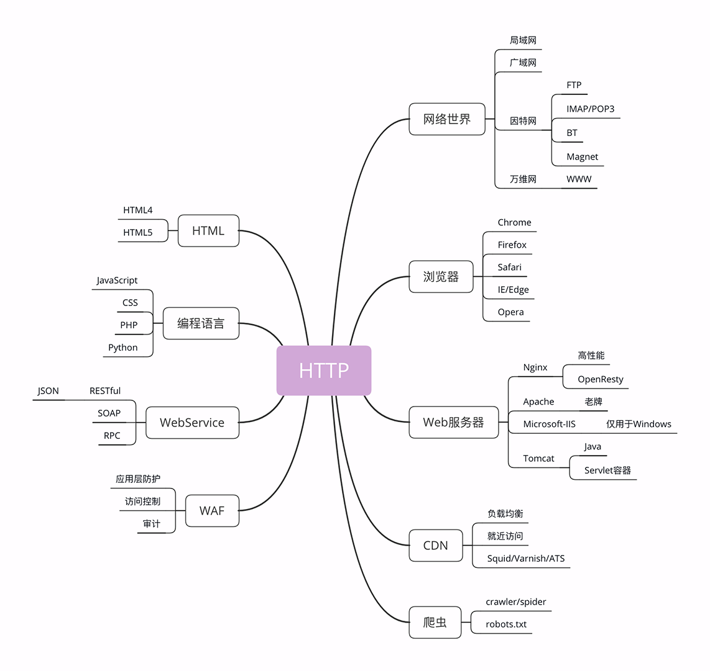

##### 2021.02.01
---
状态不佳

##### 2021.02.02
---
1. 某跳动面试官：你再说说微信扫码登录背后的实现原理？（以某东为例）
    (1). 用户点击微信icon图标,页面发起请求至 JD-HTTP的接口。，并返回loaction字段（包含appid）
    <code>
        Location: https://open.weixin.qq.com/connect/qrconnect?appid=wx827225356b689e24&state=16C44408BCCE66A99882ECB2D85A86567BAA2F274D7E27D688CE2D484A4381D35AFFAD49FD54FB2CA9C787D88B61DE8B&redirect_uri=https%3A%2F%2Fqq.jd.com%2Fnew%2Fwx%2Fcallback.action%3Fview%3Dnull%26uuid%3Dd7f9f509608744c4aa64c4116896ba5f&response_type=code&scope=snsapi_login#wechat_redirect
    </code>
    (2). 当我们点击微信图标 icon 之后，就会向JD服务器发起请求，然后就会返回给我们这个二维码图片的URL
    (3). 浏览器轮询微信服务器: 
    
    <p>浏览器 不断请求微信服务器，用户到底同不同意登录.注意 code 是返回到浏览器端的，浏览器拿着 code去请求JD服务器，而不是微信服务器去请求，结合下图更加清晰：
    
    </p>
    (4). 授权流程<br/>
    当用户得到 code 之后，来向微信开放平台通过code 加上 appid 和 appsecret来换取 access_token。
    <p>在获得了 access_token 后就可以解析用户的一些基本信息，包括头像、用户名、性别、城市等。这样一来，整个微信扫描登录的过程就完成了。</p>
    (5). 整个过程流程图
    

##### 2021.02.03
---

http相关的各种概念
<p>下图是与 HTTP 相关的各种应用，着重介绍互联网、浏览器、Web 服务器等常见且重要的概念</p>

(1). <strong>网络世界</strong>
<p>实际的互联网是由许许多多个规模略小的网络连接而成的，这些“小网络”可能是只有几百台电脑的局域网，可能是有几万、几十万台电脑的广域网，可能是用电缆、光纤构成的固定网络，也可能是用基站、热点构成的移动网络……</p>
<p>互联网世界更像是由数不清的大小岛屿组成的“千岛之国”。</p>

(2). <strong>浏览器</strong>
浏览器本质上是一个 HTTP 协议中的请求方，使用 HTTP 协议获取网络上的各种资源。当然，为了让我们更好地检索查看网页，它还集成了很多额外的功能。
<p>在 HTTP 协议里，浏览器的角色被称为“User Agent”即“用户代理”，意思是作为访问者的“代理”来发起 HTTP 请求。不过在不引起混淆的情况下，我们通常都简单地称之为“客户端”</p>

(3). <strong>web服务器(web server)</strong>
当我们谈到“Web 服务器”时有两个层面的含义：硬件和软件。
硬件含义就是物理形式或“云”形式的机器，在大多数情况下它可能不是一台服务器，而是利用反向代理、负载均衡等技术组成的庞大集群。但从外界看来，它仍然表现为一台机器，但这个形象是“虚拟的”。
软件含义的 Web 服务器可能我们更为关心，它就是提供 Web 服务的应用程序，通常会运行在硬件含义的服务器上。它利用强大的硬件能力响应海量的客户端 HTTP 请求，处理磁盘上的网页、图片等静态文件，或者把请求转发给后面的 Tomcat、Node.js 等业务应用，返回动态的信息。
Apache和nginx都是web服务器

(4). <strong> CDN </strong>
浏览器和服务器是 HTTP 协议的两个端点，那么，在这两者之间还有别的什么东西吗？  
当然有了。浏览器通常不会直接连到服务器，中间会经过“重重关卡”，其中的一个重要角色就叫做 CDN。
CDN 有什么好处呢？
<p>简单来说，它可以缓存源站的数据，让浏览器的请求不用“千里迢迢”地到达源站服务器，直接在“半路”就可以获取响应。如果 CDN 的调度算法很优秀，更可以找到离用户最近的节点，大幅度缩短响应时间。</p>
<p>CDN 也是现在互联网中的一项重要基础设施，除了基本的网络加速外，还提供负载均衡、安全防护、边缘计算、跨运营商网络等功能，能够成倍地“放大”源站服务器的服务能力，很多云服务商都把 CDN 作为产品的一部分，我也会在后面用一讲的篇幅来专门讲解 CDN。</p>
(5).  <strong>爬虫 </strong>
前面说到过浏览器，它是一种用户代理，代替我们访问互联网。
<p>但 HTTP 协议并没有规定用户代理后面必须是“真正的人类”，它也完全可以是“机器人”，这些“机器人”的正式名称就叫做“爬虫”（Crawler），实际上是一种可以自动访问 Web 资源的应用程序。</p>
爬虫是怎么来的呢？
<p>绝大多数是由各大搜索引擎“放”出来的，抓取网页存入庞大的数据库，再建立关键字索引，这样我们才能够在搜索引擎中快速地搜索到互联网角落里的页面。</p>
(6).  <strong>HTML/WebService/WAF </strong>
<p><strong>HTML</strong> 是 HTTP 协议传输的主要内容之一，它描述了超文本页面，用各种“标签”定义文字、图片等资源和排版布局，最终由浏览器“渲染”出可视化页面。</p>
<strong>Web Service</strong>是一种由 W3C 定义的应用服务开发规范，使用 client-server 主从架构，通常使用 WSDL 定义服务接口，使用 HTTP 协议传输 XML 或 SOAP 消息，也就是说，它是一个基于 Web（HTTP）的服务架构技术，既可以运行在内网，也可以在适当保护后运行在外网。
<strong>WAF</strong> 是近几年比较“火”的一个词，意思是“网络应用防火墙”。与硬件“防火墙”类似，它是应用层面的“防火墙”，专门检测 HTTP 流量，是防护 Web 应用的安全技术。
<p>WAF 通常位于 Web 服务器之前，可以阻止如 SQL 注入、跨站脚本等攻击，目前应用较多的一个开源项目是 ModSecurity，它能够完全集成进 Apache 或 Nginx。</p>

#### 小结
---
<ul>
    <li>1. 互联网上大部分资源都使用http协议进行传输</li>
    <li>2. 浏览器是http协议里的请求方,即User Agent</li>
    <li>3. 服务器是http协议里的应答方,常用的有Apache, nginx</li>
    <li>4. CDN在浏览器与服务器之间，主要起到缓存加速的作用</li>
    <li>5. 爬虫是另一类的User Agent,是自动访问网络资源的程序</li>
</ul>

#### 课下作业
---
1. 你觉得 CDN 在对待浏览器和爬虫时会有差异吗？为什么？
没有差异，cdn他主要是起到缓存加速的作用，分辨不出是否是真实的用户在访问网站。
2. 你怎么理解 WebService 与 Web Server 这两个非常相似的词？
WebService是一种应用服务规范，web server是服务器，可以承载应用；也就是说WebService运行在web server上

##### 2021.02.04
---
<p style="font-weight: bold; font-size:30px">Leetcode</p>
---

> 605 Can Place Flowers 假设你有一个很长的花坛，一部分地块种植了花，另一部分却没有。可是，花卉不能种植在相邻的地块上，它们会争夺水源，两者都会死去。给定一个花坛（表示为一个数组包含0和1，其中0表示没种植花，1表示种植了花），和一个数 n 。能否在不打破种植规则的情况下种入 n 朵花？能则返回True，不能则返回False

示例 1:
> 输入: flowerbed = [1,0,0,0,1], n = 1
> 输出: True

```
    var canPlaceFlowers = function(flowerbed, n) {
        let length = flowerbed.length;
        for (let i = 0; i<length; i++) {
            if (flowerbed[i] != 1 && flowerbed[i-1] != 1 && flowerbed[i+1] != 1) {
                n--;
                i++;
            }
        }
        return n <= 0;
    };
```

> 89 格雷编码
> 格雷编码是一个二进制数字系统，在该系统中，两个连续的数值仅有一个位数的差异。给定一个代表编码总位数的非负整数 n，打印其格雷编码序列。格雷编码序列必须以 0 开头。  

例子

> 输入: 2
> 输出:[0,1,3,2]
> 解释:
00 - 0
01 - 1
11 - 3
10 - 2
> 对于给定的 n，其格雷编码序列并不唯一。
> 例如，[0,2,3,1] 也是一个有效的格雷编码序列。
>00 - 0
10 - 2
11 - 3
01 - 1

分析：观察规律，grayCode(n)分为两部分，一部分就是grayCode(n-1)，另一部分就是grayCode(n - 1)每一位都加上2^(n-1)再进行反转
```
function grayCode(n) {
    if(n == 0) return [0];
    let addend = Math.pow(2, n-1);
    let per = grayCode(n-1);
    let end = per.map(function(item){
        return item + addend;
    })
    end = end.reverse();
    return [...per, ...end]
};
```
> 重复的子字符串

> 给定一个非空的字符串，判断它是否可以由它的一个子串重复多次构成。给定的字符串只含有小写英文字母，并且长度不超过10000。

例子

<code>
    示例 1:

    输入: "abab"

    输出: True

    解释: 可由子字符串 "ab" 重复两次构成。
    示例 2:

    输入: "aba"
    
    输出: False
    示例 3:

    输入: "abcabcabcabc"

    输出: True

    解释: 可由子字符串 "abc" 重复四次构成。 (或者子字符串 "abcabc" 重复两次构成。)

</code>

```
var repeatedSubstringPattern = function(s) {
    // return /^([a-z]+)\1+$/.test(s); // a-z表示一个分组出现多次，\1特指第一个分组，$表示以分组匹配到的字符串结尾
    let S = (s+s).slice(1, -1); //假设母串S是由子串s重复N次而成， 则 S+S则有子串s重复2N次， 那么现在有： S=Ns， S+S=2Ns， 其中N>=2。 如果条件成立， S+S=2Ns, 掐头去尾破坏2个s，S+S中还包含2*（N-1）s, 又因为N>=2, 因此s在(S+S)[1:-1]中必出现一次以上
    return S.indexOf(s) > -1
};
```

##### 2021.02.05
---
<strong>基础</strong>
冒泡排序
```
    function sort(nums){
        let length = nums.length;
        for (let i = length-1; i>=0; i--) {
            for(let j = 0; j < i; j++) {
                if (nums[j] > nums[i]) {
                    [nums[i], nums[j]] = [nums[j], nums[i]]
                }
            }
        }
            
        return nums
    }
```
选择排序(找出区间内最小的值)
```
    function selectSort(arr) {
        let minIndex;
        let len = arr.length;
        for (let i = 0; i < len - 1; i++) {
            minIndex = i;
            for (let j = i+1; j < len; j++) {
                if (arr[j] < arr[minIndex]) {
                    minIndex = j;
                }
            }
            if (minIndex != i) {
                [arr[i], arr[minIndex]] = [arr[minIndex], arr[i]]
            }
        }
        return arr;
    }
```
leetcode
> 164. 最大间距
给定一个无序的数组，找出数组在排序之后，相邻元素之间最大的差值。
如果数组元素个数小于 2，则返回 0。

示例 1:
> 输入: [3,6,9,1]
输出: 3
解释: 排序后的数组是 [1,3,6,9], 其中相邻元素 (3,6) 和 (6,9) 之间都存在最大差值 3。

示例 2:
> 输入: [10]
输出: 0
解释: 数组元素个数小于 2，因此返回 0。
```
    var maximumGap = function(nums) {
        let length = nums.length;
        let max = 0;
        if (length < 2) return 0;
        // 冒泡排序=> 最后一个元素是最大值
        
        for (let i = length-1; i>=0; i--) {
            for(let j = 0; j < i; j++) {
                if (nums[j] > nums[i]) {
                    [nums[i], nums[j]] = [nums[j], nums[i]];
                }
            }
            if (nums[i + 1]) {
                let t = nums[i + 1] - nums[i];
                if (max < t) max = t;
            }
        }
        return max
    };
```


##### 2021.02.07
---
leetcode

> 215. 数组中的第K个最大元素
在未排序的数组中找到第 k 个最大的元素。请注意，你需要找的是数组排序后的第 k 个最大的元素，而不是第 k 个不同的元素。

示例 1:
> 输入: [3,2,1,5,6,4] 和 k = 2
输出: 5

示例 2:
> 输入: [3,2,3,1,2,4,5,5,6] 和 k = 4
输出: 4

```
    var findKthLargest = function(nums, k) {
        let len =  nums.length;
        for (let i = len-1; i >= len - k; i--) {
            for (let j = 0; j < i; j++) {
                if (nums[j] > nums[i]) {
                    [nums[i], nums[j]] = [nums[j], nums[i]];
                }
            }
        }
        return nums[len-k];
    };
```

> 41. 缺失的第一个正数
给你一个未排序的整数数组 nums ，请你找出其中没有出现的最小的正整数。
进阶：你可以实现时间复杂度为 O(n) 并且只使用常数级别额外空间的解决方案吗？

示例 1：
> 输入：nums = [1,2,0]
输出：3

示例 2：
> 输入：nums = [3,4,-1,1]
输出：2

示例 3：
输入：nums = [7,8,9,11,12]
输出：1

```
    var firstMissingPositive = function(nums) {
        // 筛掉非整数元素
        nums = nums.filter(item => item > 0);
        if (nums.length) {
            // 升序
            nums = nums.sort((a, b) => a-b);
            // 如果第一个元素不为1
            if (nums[0] - 1) {
                return 1;
            } else {
                let len = nums.length;
                // 如果下一个元素与当前元素差大于1，那么未出现的正整数是当前元素+1
                for (let i = 0; i < len - 1; i++) {
                    if (nums[i + 1] - nums[i] > 1) {
                        return nums[i] + 1;
                    }
                }
                // 如果没有找到元素间差大于1的元素，那么取最大元素
                return nums.pop()+1
            }
        } else {
            return 1;
        }  
    };
```