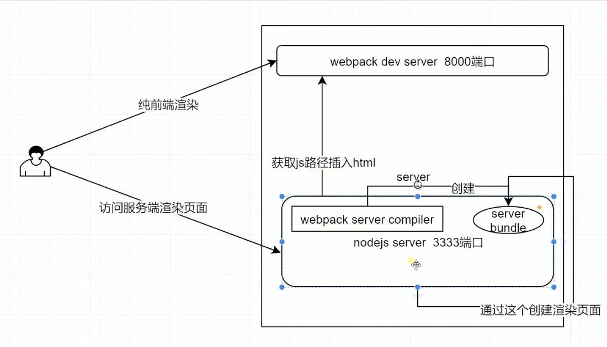

#### 2021.03.22
---
> 路由参数传递
routes.js
* `path`后可以跟`params`参数，这个参数可以通过`props`传到相应的组件里面去,各种写法可以参考下面的例子，也可以在这个组件里访问`this.$route`来获取里面的参数，但是这么做耦合太强了，不推荐这种用法
* 可以使用`name`为路由命名，跳转的时候可以这么写`<router-link :to="{name: '路由中起的名字'}"></routre-link>`，`router-link`本质是a标签。
* `meta`属性可以放置一些想要获取到的信息，可以通过`this.$route`来进行访问
* 还可以有子路由，父组件中需要有`<router-view>`来占位（`<router-view>`其实是来占位的）
```
    [
    {
        path: '/',
        redirect: '/app'
    },
    {
        path: '/app/:id',  // 匹配的是/app/xxx
        // props: true,   // 会把id传到todo组件里面来
        // props: {
        //   id: 456
        // },
        props: (route)=>({id: route.query.b}),
        component: Todo,
        name: 'app', // 路由命名
        meta: { // 保存一些想要获取到的信息，拿到路由对象就可以访问这个属性了
            title: 'this is app',
            description: 'ajajai'
        },
        // children: [
        //   {
        //     path: 'test',
        //     component: Login
        //   }
        // ]
    },
    {
        path: '/login',
        component: Login
    },
    // {
    //   path: '/login/exact',
    //   component: Login
    // }
    ]
```
> 路由切换的时候，可以添加过渡效果
app.vue
```
    <transition name="fade">
        <router-view></router-view>
    </transition>
```
xxx.styl文件
```
    .fade-enter-active, .fade-leave-active
        transition opacity 0.5s
    .fade-enter, .fade-leave-to
        opacity 0
```

#### 2021.03.23
---
> 路由导航守卫
* 如果一个路由下要显示多个组件:可以用这个路由中配置的组件中包含这多个组件;可以添加一个`router-view`,为其配置名称`name`，route中配置`components:{defalut: 组件1，name:组件2 }`
>app.vue
```
    <transition name="fade">
        <router-view></router-view>
    </transition>
    <Footer></Footer>
    <router-view name="a"></router-view>
```

> routes.js
```
    import Todo from '../views/todo/todo.vue'
    import Login from '../views/login/login.vue'
    export default [
        {
            path: '/',
            redirect: '/app'
        },
        {
            path: '/app/:id',  // 匹配的是/app/xxx
            props: true,   // 会把id传到todo组件里面来
            components: {
                default: Todo,
                a: Login
            },
            name: 'app', // 路由命名
        }
    ]

```
* index.js中的守卫： beforeEach-路由跳转之前触发、beforeResolve、afterEach-路由跳转之后触发
* routes.js中的守卫：beforeEnter-在进入这个路由之前触发
* 组件内的守卫：beforeRouteEnter-首次加载这个组件时触发,这时候拿不到this值、beforeRouteUpdate-路由上某个值变化触发，例如商品id、beforRouteLeave-离开时触发，挽留用户，比如离开时弹窗或做些其他处理
> index.js
```
    ...
    router.beforeEach((to, from, next)=> { // 路由跳转之前触发
        console.log('before Each invoked')
        next() // 需执行next，不然跳转不了
        // 可以在这个函数里进行数据校验
        // if (to.fullPath === '/login') {
        //   next() // 需执行next，不然跳转不了
        // } else {
        //   next('/login')  // next也可以指定跳转的路由，也可以是{path: '', }和router-view上定义的Props是一样的
        // }

    })
    router.beforeResolve((to, from, next) => {
        console.log('before resolve invoked')
        next()
    })
    router.afterEach((to, from) => {
        console.log('after Each invoked')
    })
```
> routes.js
```
    ...
    {
        path: '/app/:id',  // 匹配的是/app/xxx
        props: true,   // 会把id传到todo组件里面来
        component: Todo,
        name: 'app', // 路由命名
        meta: { // 保存一些想要获取到的信息，拿到路由对象就可以访问这个属性了
            title: 'this is app',
            description: 'ajajai'
        },
        beforeEnter: (to, from, next) => { // 在进入这个路由之前触发
            console.log('app route before enter')
            next()
        }
    }
    ...
```
> 组件中,例todo.vue
```
    export defalut{
        beforeRouteEnter (to, from, next) {
            // 这里没有this,因为这时候this还没有创建
            console.log('to', to)
            console.log('to do from enter', this)
            next(vm => { // beforeRouteEnter中拿不到this,一般可以获取数据后，在next的回调里给this设置数据
                console.log('after enter this.id is', vm.id)
            })
        },
        beforeRouteUpdate(to, from, next) {
            console.log('to do from update')
            next()
        },
        beforeRouteLeave (to, from, next) {
            // 挽留用户，比如离开时弹窗
            if (global.confirm('are you sure?')) {
                console.log('to do from leave')
                next()
            }
        },
        created() {
            console.log('______todo mounted id', this.id)
        },
    }
    
```
* 钩子触发顺序： beforEach->beforeEnter->beforeRouteEnter(首次进入这个组件，如果后续某个参数变了，可还是进入的是这个路由对应的页面，那么是会beforeRouteUpdate)->beforeResolve->afterEach

* beforeRouteEnter是拿不到this值得，可以在next的回调里查看this
```
    beforeRouteEnter(to, from, next){
        next(vm => { // beforeRouteEnter中拿不到this,一般可以获取数据后，在next的回调里给this设置数据
            console.log('after enter this.id is', vm.id)
        })
    }
```
* 异步组件-如果只打开一个路由，那么加载其他路由下的组件是没有必要的，引入了异步组件
> routes.js
```
    export default [
        {
            path: '/',
            redirect: '/app'
        },
        {
            path: '/app:id',
            props: true,
            component: ()=> import('../view/todo/todo.vue') // 异步加载
        }
    ]
```
> 这样动态引进组件后，编译会提示错误，这时候需要安装`npm i babel-plugin-syntax-dynamic-import -D`,接着在.babelrc中加入配置
```
    {
        "presets": [
            "env"
        ],
        "plugins": [
            "transform-vue-jsx",
            "syntax-dynamic-import"
        ]
    }
```

> HTTP： TCP/IP的四层和OSI的七层
1. TCP/IP协议是一个“有层次的协议栈”
> TCP/IP
* TCP/IP协议总共有四层，顺序从下往上 链接层->网际层->传输层->应用层
* 链接层 link layer ，负责在底层网络上发送原始数据包，使用MAC地址来标记网络上的设备，所以也叫MAC层
* 网际层 internet layer，IP协议所在层，在链接层的基础上，用IP地址取代MAC地址，把许多局域/广域网连接成虚拟的巨大网络，在这个网络里找设备时只要把IP地址再翻译成MAC地址就可以
* 传输层 transport layer，TCP、UDP协议所在层，这个层次协议的职责是保证数据在IP地址标记的两点之间可靠地传输。
>TCP和UDP区别：
* TCP 有状态 需要先建立连接才能发送数据 保证数据不丢失不重复 数据是连续的字节流，有先后顺序
* UDP 无状态 不需要先建立连接也可以发送数据 不保证数据一定会发送到对方 数据是分散的小数据包，顺序发、乱序收
* 应用层 application layer，Telnet、SSH、FTP、SMTP、HTTP
> MAC层的传输单位是帧（frame），IP层的传输单位是包（packet），TCP层的传输单位是段（segment），HTTP的传输单位是消息或报文（message）。统称为数据包

> OSI网络分层模型
1. 第一层:物理层，网络的物理形式，例如电缆、光纤、网卡、集线器等等;
2. 第二层:数据链路层，它基本相当于TCP/IP的链接层;
3. 第三层:网络层，相当于TCP/IP里的网际层;
4. 第四层:传输层，相当于TCP/IP里的传输层;
5. 第五层:会话层，维护网络中的连接状态，即保持会话和同步;
6. 第六层:表示层，把数据转换为合适、可理解的语法和语义;
7. 第七层:应用层，面向具体的应用传输数据。
> TCP/IP四层模型和OSI七层网络模型的映射关系
1. 第一层:物理层，TCP/IP里无对应;
2. 第二层:数据链路层，对应TCP/IP的链接层;
3. 第三层:网络层，对应TCP/IP的网际层;
4. 第四层:传输层，对应TCP/IP的传输层;
5. 第五、六、七层:统一对应到TCP/IP的应用层。
* 四层负载均衡：工作在传输层上，基于TCP/IP协议的特性，例如Ip地址，端口号等实现对后端服务器的负载均衡
* 七层负载均衡：工作在应用层上，看到的是HTTP协议，解析HTTP报文里的URI、主机名、资源类型等数据，再用适当的策略转发给后端服务器


> vuex
> store.js
```
    import Vuex from 'vuex'

    export default () => {
        return new Vuex.Store({
            state: {
                count: 0
            },
            mutations: {
                updateCount(state, num) {
                    state.count = num
                }
            }
        })
    }
```

> index.js
```
    import Vue from 'vue'
    import Vuex from 'vuex'
    import createStore from './store/store.js'
    
    Vue.use(Vuex)
    const store = createStore()
    new Vue({
        el: '#root',
        store,
        template: '<div></div>'
    })
    
```
> 使用commit来更新数据
> app.vue
```
    <template>
    <div id="app">
        <div id="cover"></div>
        <Header></Header>
        {{count}}
        <!-- <Todo></Todo> -->
        <!-- <router-link :to="{name: 'app'}">app</router-link> -->
        <router-link to="/app/123">app123</router-link>
        <router-link to="/app/456">app456</router-link>
        <router-link to="/login">login</router-link>
        <!-- <router-link to="/login/exact">login exact</router-link> -->
        <transition name="fade">
          <router-view></router-view>
        </transition>
        <Footer></Footer>
        <!-- <router-view name="a"></router-view> -->
        </div>
    </template>

    <script>
    import Header from './layout/header.vue'
    import Footer from './layout/footer.jsx'
    // import Todo from './views/todo/todo.vue'

    console.log(Header.__docs)
    export default {
        components: {
            Header,
            Footer,
            // Todo
        },
        mounted() {
            console.log('store', this.$store)
            let i = 1
            setInterval(()=> {
                this.$store.commit('updateCount', i++)
            }, 1000)
            // console.log(this.$route)
        },
        computed: {
            count() {
                return this.$store.state.count
            }
        }
    }
    </script>

    <style lang="stylus" scoped>
    #app
        position absolute
        left 0
        right 0
        top 0
        bottom 0
        #cover
            position absolute
            left 0
            right 0
            top 0
            bottom 0
            background-color #999
            opacity 0.2
            z-index -1

    </style>

```
> state&getters
* 访问state中的属性：1.`this.$store.state.xxx`2.`...mapState(['xxx'])`
* `getters`中的属性类似于`computed`中的属性，只要依赖的数据有修改，值就会重新计算
```
    import {mapState, mapGetters} from 'vuex'
    export default {
        name: 'app',
        computed: {
            count() {   
                return this.$store.state.count
            },
            // ...mapState(['count'])
            // 重命名 ...mapState({counter: 'count'})
            fullName() {
                return this.$store.getters.fullName
            }
            // ...mapgetters(['fullName'])
        }
    }
```

> mutations&actions
* `actions`中接收2个参数： `store`和data(如果有多个值，这个值可以写成对象)
```
    import {mapMutations, mapActions} from 'vuex'
    export default {
        methods: {
            ...mapMutations(['updateCount']),
            ...mapActions(['updateCountAsync'])
        },
        mounted(){
            /* this.$store.dispatch('updateCountAsync', {
                    num: 5,
                    time: 2000
                }) */
            this.updateCountAsync({
                num: 5,
                time: 2000
            })
           // this.$store.commit('updateCount', 10)
            this.updateCount(10)
        }
    }
```

#### 2021.03.24
---
> vuex的module

store.js
```
    import Vuex from 'vuex'
    export default () => {
        return new Vuex.Store({
            state: {
                count: 1,
                firstName: 'fu',
                secondName: 'bodi'
            },
            getters: {
                getFullName(state) {
                    return state.firstName + state.secondName
                }
            },
            mutations: {
                updateCount(state, num) {
                    state.count = num
                }
            },
            actions: {
                updateCountAsync (store, data) {
                    setTimeout(()=> {
                        store.commit('updateCount', data.num)
                    }, 1000)
                }
            },
            modules: {
                a: {
                    namespaced: true, // 命名空间限制
                    state: {
                        text: 1
                    },
                    mutations: {
                        updateText(state, text) {
                            // state是a中的state
                            state.text = text
                        }
                    },
                    getters: {
                        textPlus(state, getters, rootState) { // getters是当前的作用下的getters,rootState是根的state
                            // return state.text + 1
                            // return state.text + rootState.count
                            return state.text + rootState.b.text // 同样也可以拿到b模块下的state中的值
                        }
                    },
                    actions: {
                        add({state, commit, rootState}) { // ctx是a模块的context,里面包含state, commit, rootState
                            // commit('updateText', rootState.count) //f) 修改自身的state中的值 
                            // commit('updateCount', 4566, {root: true}) //f) 修改全局的state中的值 
                        }
                    }
                },
                b: {
                    namespced: true,
                    state: {
                        text: 2
                    },
                    actions: {
                        testText({commit}) { 
                            commit('a/updateText', 789, {root: true}) //f) 修改模块间的state中的值    
                        }
                    }
                }
            }
        })
    }
```
app.vue
```
    export default {
        computed: {
            /*textA() {  // 写法1
                return this.$store.state.a.text
            }*/
            ...mapState({  // 写法2
                textA: state => state.a.text
            })
            // ...mapGetters(['a/textPlus'])  // a). 获取a模块下getters中的textplus
            ...mapGetter({
                textPlus: 'a/textPlus' // d). 这样模板里可以用{{textPlus}}访问值了,重命名后怎么在逻辑中访问这个值还有待查询
            })
        },
        methods: {
            //...mapMutations(['updateText']) //b) 获取a模块下mutations中的updateText(未加命名空间)
            ...mapMutations(['a/updateText']) //c) 获取a模块下mutations中的updateText(加了命名空间)
            ...mapActions(['a/add']) // e) 
        },
        mounted() {
            // this.updateText(123) //b) 这样也可以修改a作用域下的text值,因为vuex会把mutation放到全局的命名空间中,可以在store中的a模块下添加namespaced：true来限制添加到全局命名空间
            // this['a/updateText'](123) //c) 加了命名空间，修改a作用域下的text值
            // console.log('textPlus', this['a/textPlus']) // a). 这样可以调用a模块中getters中的方法，但是这样在模板中不好调用，所以可以在mapGetters中为其重命名
            this['a/add']() // e)
        }
    }
```
> 动态加载module模块
index.js
```
    import createStore from './store/store.js'
    import Vuex from 'vuex'
    Vue.use(Vuex)
    const store = createStore()
    store.registerModule('c', {
        state: {
            text: 3
        }
    })
    new Vue({
        router,
        store,
        render: (h) => h(App)
        // vue在创建Vue实例时,通过调用render方法来渲染实例的DOM树,也就是这个组件渲染的是App的内容
        // vue在调用render方法时,会传入一个createElement函数作为参数,也就是这里的h的实参是createElement函数,然后createElement会以App为参数进行调用
    }).$mount('#root') // 挂载html的root节点下面

```
app.vue
```
    export default {
        computed: {
            ...mapState({
                textC: state => state.c.text
            })
        }
    }
```

> store热更新： 修改store中的任何值，都会触发页面刷新，可以添加如下代码，使得页面不刷新

store.js
```

    import Vuex from 'vuex'
    import defaultState from './state/state'
    import mutations from './mutations/mutations'
    import getters from './getters/getters'
    import actions from './actions/actions'

    const isDev = process.env.NODE_ENV == 'development'

    export default () => {
    const store = new Vuex.Store({
        strict: isDev, // 防止不通过mutation修改数据，不要在正式环境使用
        state: defaultState,
        mutations,
        getters,
        actions,
        /* modules: {
            a: {
                namespaced: true, // 加命名空间，防止冲突
                state: {
                text: 1
                },
                mutations: {
                    updateText(state, text){
                        console.log('a state', state)
                        state.text = text
                    }
                },
                getters: {
                    textPlus(state, getters, rootState) { // getters是当前的作用下的getters,rootState是根的state
                        console.log('getters', getters)
                        // return state.text + rootState.count
                        return state.text + rootState.b.text
                    }
                },
                actions: {
                    add({state, commit, rootState}) { // ctx是a模块的context,里面包含state, commit, rootState
                        // commit('updateText', rootState.count)
                        commit('updateCount', 1234, {root: true})
                    }
                }
            },
            b: {
                namespaced: true,
                state: {
                    text: 2
                },
                actions: {
                    textAction({commit}) {
                        commit('a/updateText', 'text test', {root: true})
                    }
                }
            }
        } */
    })
    if (module.hot) {
        module.hot.accept([
            './state/state',
            './mutations/mutations',
            './getters/getters',
            './actions/actions'
        ], () => {
            const newState = require('./state/state').default;
            const newMutations = require('./mutations/mutations').default;
            const newGetters = require('./getters/getters').default;
            const newActions = require('./actions/actions').default;
            store.hotUpdate({
                state: newState,
                mutations: newMutations,
                getters: newGetters,
                actions: newActions
            })
        })
    }
        return store
    }

```

> Vuex之其他的Api

index.js
```
    store.watch(state => state.count + 1, newCount => { // state => state.count + 1相当于getters中的写法，只要这个值有变化，会触发后面这个函数
        console.log('new count watched', newCount)
    })
    store.subscribe((mutation, state)=> {
        // console.log('mutation.type',mutation.type) // mutation的名称
        // console.log('mutation.payload', mutation.payload) // 传给mutation的值
    })

    store.subscribeAction((action, state)=> {
        console.log('______action.type', action.type)
        console.log('action.payload', action.payload)
    })
```
> vuex中还可以写plugins,plugins是个数组，每个元素是个方法，该方法只会被执行一次

store.js
```
    export default ()=> {
        return new Vuex.Store({
            ...
            plugins: [
                store => {
                    store.subscribe((mutation, state) => {

                    })
                }
            ]
        })
    }
    
```


#### 2021.03.26
> 服务端渲染的配置
webpack.config.server.js
* 设置target,指定打包出来的文件是在node端运行
* 指定入口：server-entry.js
* 指定出口： libraryTarget、filename、path
* externals: 除了这些文件其他都要打包
* css文件不打包在html中，因为在node端没有dom
* 设置plugins
* 设置VueServerPlugin，对打包出的json文件做服务端渲染处理

```
    const path = require('path')                            //path是Nodejs中的基本包,用来处理路径
    const webpack = require("webpack")                      //引入webpack
    const webpackMerge = require("webpack-merge")
    const ExtractPlugin = require("extract-text-webpack-plugin")
    const baseConfig = require("./webpack.config.base")
    const VueServerPlugin = require("vue-server-renderer/server-plugin")


    const isDev = process.env.NODE_ENV === "development"    //判断是否为测试环境,在启动脚本时设置的环境变量都是存在于process.env这个对象里面的


    let config

    config = webpackMerge.merge(baseConfig, {
        target: 'node',  // 打包出来的文件是在node端运行
        entry: path.join(__dirname, '../client/server-entry.js'),
        output: {
            libraryTarget: 'commonjs2',   // 表示export出去的方式：module.exports,引用require ,打包出一个json文件
            filename: 'server-entry.js', // 文件名称
            path: path.join(__dirname, '../server-build') // 输出目录
        },
        externals: Object.keys(require('../package.json').dependencies),  // 除了这几个文件其他的都要打包。直接在打包出来的js引用要依赖的东西，不用像前端渲染时把依赖的一些包也打包进同一个js中
        devtool: 'source-map', // 官方推荐使用这个配置,作用是在浏览器中调试时,显示的代码和我们的项目中的代码会基本相似,而不会显示编译后的代码,以致于我们调试连自己都看不懂
        module: {
            rules: [
                {
                test: /\.styl/,
                use: ExtractPlugin.extract({
                    fallback: 'style-loader',
                    use: [
                        'css-loader',                       //css-loader处理css
                        {
                            loader: 'postcss-loader',
                            options: {
                                sourceMap: true,            //stylus-loader和postcss-loader自己都会生成sourceMap,如果前面stylus-loader已生成了sourceMap
                            }                               //那么postcss-loader可以直接引用前面的sourceMap
                        },
                        'stylus-loader'                     //处理stylus的css预处理器的问题件,转换成css后,抛给上一层的css-loader
                    ]
                })
            }
            ]
        },
        resolve: {
            alias: {
                'vue': path.join(__dirname, '../node_modules/vue/dist/vue.esm.js')
            }
        },
        plugins: [ //添加两个插件用于hot:true的配置
            new ExtractPlugin('styles.[contentHash:8].css'),   //定义打包分离出的css文件名
            new webpack.DefinePlugin({
            'process.env.NODE_ENV': JSON.stringify(process.env.NODE_ENV || 'development'),
            'process.env.VUE_ENV': '"server"'
            }),
            new VueServerPlugin() // 对打包出的json文件做很多服务端渲染相关的内容
        ]
    })

    module.exports = config                                 //声明一个config的配置,用于对外暴露

```

#### 2021.03.27
---
休息

#### 2021.03.28
* 打包vue的整个代码逻辑（运行在node端）实现方法：在node server中启动webpack.server.compiler,使用这个compile去生成一个server bundle（app.js）,再使用vue-server-renderer去生成html（只是body中的代码，没有script标签引js,这个js需要去客户端生成的App.js中去获取，并插入到html中，组成一个完整的html返回给用户，否则用户是不能与页面进行交互）

> koa实现node server
* 创建server.js(npm i koa -S  / )
```
    const Koa = require('koa')

    const pageRouter = require('./routers/dev-ssr')

    const app = new Koa()

    const isDev = process.env.NODE_ENV === 'development'

    app.use(async (ctx, next) => {
        try {
            console.log(`request path ${ctx.path}`)
            await next()
        } catch(e) {
            console.log(e)
            ctx.status = 500
            if (isDev) {
                ctx.body = e.message
            } else {
            ctx.body = `please try again later`
            }
        }
    })

    app.use(pageRouter.routes()).use(pageRouter.allowedMethods()) // koa的既定用法，不需要关心
    const HOST = process.env.HOST || '0.0.0.0'
    const PORT = process.env.PORT || 3333

    app.listen(PORT, HOST, () => {
        console.log(`server is listening on ${HOST}:${PORT}`)
    })
```
* 创建ssr.js和dev-ssr.js(npm i koa-router -S/npm i axios -S/npm i memory-fs -D)
> dev-ssr.js
```
    const Router = require('koa-router')
    const axios = require('axios')
    const path = require('path')
    const MemoryFs = require('memory-fs')
    const webpack = require('webpack')
    const fs = require('fs') // 读取模板
    const VueServerRenderer = require('vue-server-renderer')

    const serverRender = require('./server-render')
    const serverConfig = require('../../build/webpack.config.server')


    const serverCompiler = webpack(serverConfig)
    const mfs = new MemoryFs() // 读写内存中的文件，比读取磁盘文件更快
    serverCompiler.outputFileSystem = mfs // 指定输出路径在mfs

    let bundle // 记录webpack打包生成的新的文件
    serverCompiler.watch({}, (err, stats) => { // 在文件有变化的时候，在服务端重新打包
        if (err) throw err
        stats = stats.toJson()
        stats.errors.forEach(err => console.log(err))
        stats.warnings.forEach(warn => console.warn(warn))

        const bundlePath = path.join(
            serverConfig.output.path,
            'vue-ssr-server-bundle.json' // vue-server-render生成的文件名，body中的部分
        )
        bundle = JSON.parse(mfs.readFileSync(bundlePath, 'utf-8'))
        console.log('new bundle generated')
    })
    const handleSSR = async ctx => {
        console.log("bundle", bundle)
        if (!bundle) {
            ctx.body = `你等一会 `
            return
        }

        const clientManifestResp = await axios.get( // 获取浏览器端webpack中打包好的json
            'http://127.0.0.1:8000/public/vue-ssr-client-manifest.json' // vue-ssr-client-manifest.json是这个插件VueClientPlugin生成的文件名
        )
        console.log('_____',clientManifestResp.data)
        const clientManifest = clientManifestResp.data

        const template = fs.readFileSync( // 读取模板
            path.join(__dirname, '../server.template.ejs'),
            'utf-8'
        )

        const renderer = VueServerRenderer.createBundleRenderer(bundle, {
            inject: false, // 指定一个template，这个tamplate按照官方提供的模板来指定，限制比较大
            clientManifest
        })

        await serverRender(ctx, renderer, template)
    }

    const router = new Router()
    router.get('*', handleSSR)

    module.exports = router
 
```

* 创建服务端渲染文件 server-render.js(服务端渲染)
```
    const ejs = require('ejs')

    module.exports = async (ctx, renderer, template) => {
        // 给headers里面的contentType是「text/html」
        ctx.headers['ContentType'] = 'text/html';

        const context = {url: ctx.path} // 服务端渲染时，传入vue-server-render中,渲染完成后，会添加许多东西，让我们渲染html
        try {
            const appString = await renderer.renderToString(context) // 返回一个promise

            const html = ejs.render(template, {
                appString,
                style: context.renderStyles(), // 拿到带有style标签的整个字符串,扔到html里面去
                scripts: context.renderScripts()
            }) // 把html渲染出来
            ctx.body = html
        } catch(e) {
            console.log('render error')
            throw(e)
        }
    }

```

> server.template.ejs
```
    <!DOCTYPE html>
    <html lang="en">
        <head>
            <meta charset="UTF-8">
            <meta name="viewport" content="width=device-width, initial-scale=1.0">
            <title>Document</title>
            <%- style %>
        </head>
        <body>
            <%- appString %>
            <%- scripts %>
        </body>
    </html>

```

* 服务端入口文件server-entry.js
```
    import createApp from './create-app'


    export default context => {
        return new Promise((resolve, reject) => {
            const {app, router} = createApp()

            router.push(context.url)
            router.onReady(()=> {
                const matchedComponents = router.getMatchedComponents() // 服务端渲染时才会用到
                if (!matchedComponents.length) {
                    return reject(new Error('no components matched'))
                }
                resolve(app)
            }) // 服务端渲染时才会用到.在一条路由记录被推进去之后，所有的异步操作做完之后，才会调用这个回调
        })
    }

```
> createApp.js
```
    import Vue from 'vue'
    import VueRouter from 'vue-router'
    import Vuex from 'vuex'

    import App from './app.vue'
    import createStore from './store/store'
    import createRouter from './config/router'

    import './assets/styles/global.styl'

    Vue.use(VueRouter)
    Vue.use(Vuex)

    export default () => {
        const router = createRouter()
        const store = createStore()
        const app = new Vue({
            router,
            store,
            render: h=>h(App)
        })
        return {app, router, store}
    }

```