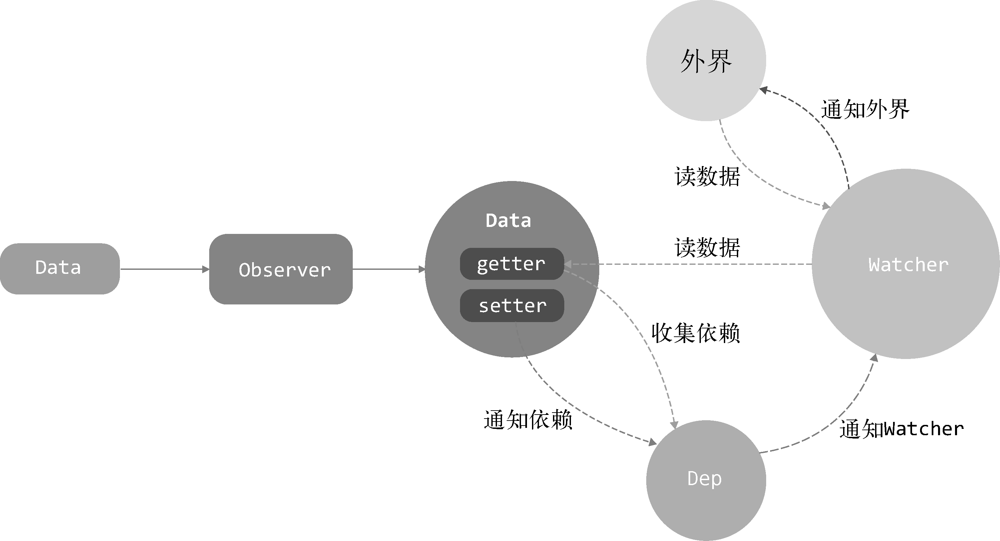

#### 2021.04.12
---
> 从输入url到页面展示,这中间发生了什么
1. 用户输入url并回车
2. 浏览器进程检查url. 组装协议. 构成完整的url
3. 浏览器进程通过进程间通信（IPC）把url请求发送给网络进程
4. 网络进程接收到url请求后检查本地缓存是否缓存了该请求资源. 如果有则将该资源返回给浏览器进程
5. 如果没有. 网络进程向web服务器发起http请求（网络请求）. 请求流程如下：
    >5.1 进行DNS解析. 获取服务器ip地址. 端口（端口是通过dns解析获取的吗？这里有个疑问）
    
    >5.2 利用ip地址和服务器建立tcp连接
    
    >5.3 构建请求头信息
    
    >5.4 发送请求头信息
    
    >5.5 服务器响应后. 网络进程接收响应头和响应信息. 并解析响应内容
6. 网络进程解析响应流程；
    >6.1 检查状态码. 如果是301/302. 则需要重定向. 从Location自动中读取地址. 重新进行第4步
        
        （301/302跳转也会读取本地缓存吗？这里有个疑问）. 如果是200. 则继续处理请求。
    >6.2 200响应处理：

        检查响应类型Content-Type. 如果是字节流类型. 则将该请求提交给下载管理器. 该导航流程结束. 不再进行
        后续的渲染. 如果是html则通知浏览器进程准备渲染进程准备进行渲染。
7. 准备渲染进程
    7.1 浏览器进程检查当前url是否和之前打开的渲染进程根域名是否相同. 如果相同. 则复用原来的进程. 如果不同. 则开启新的渲染进程
8. 传输数据、更新状态
    >8.1 渲染进程准备好后. 浏览器向渲染进程发起“提交文档”的消息. 渲染进程接收到消息和网络进程建立传输数据的“管道”

    >8.2 渲染进程接收完数据后. 向浏览器发送“确认提交”

    >8.3 浏览器进程接收到确认消息后更新浏览器界面状态：安全、地址栏url、前进后退的历史状态、更新web页面。

2021.04.13
---
> 渲染流程
1. 构建 DOM 树
    > 输入：HTML 文档；-> 处理：HTML 解析器解析；-> 输出：DOM 数据解构
2. 样式计算
    > 输入：CSS 文本； -> 处理：属性值标准化，每个节点具体样式（继承、层叠）； -> 输出：styleSheets(CSSOM)。
3. 布局计算
    > DOM和computed Style构建成布局树 -> 布局计算:计算布局树节点的坐标位置
4. 分层
    > 特定节点生成专用图层，生成一棵图层树 -> 拥有层叠上下文属性（明确定位属性、透明属性、CSS 滤镜、z-index 等)的元素会创建单独图层 -> 没有图层的 DOM 节点属于父节点图层 -> 需要剪裁的地方也会创建图层。
5. 图层绘制
    > 在完成图层树的构建之后，渲染引擎会对图层树中的每个图层进行绘制 -> 渲染引擎会把一个图层的绘制拆分成很多小的绘制指令 -> 然后再把这些指令按照顺序组成一个待绘制列表
6. 柵格化操作
    > 主线程会把该绘制列表提交（commit）给合成线程 -> 合成线程会将图层划分为图块 -> 栅格化，是指将图块转换为位图 -> 栅格化过程都会使用 GPU 来加速生成，使用 GPU 生成位图的过程叫快速栅格化，或者 GPU 栅格化，生成的位图被保存在 GPU 内存中
7. 合成和显示
    > 一旦所有图块都被光栅化，合成线程就会生成一个绘制图块的命令——“DrawQuad”，然后将该命令提交给浏览器进程。-> 浏览器进程里面有一个叫 viz 的组件，用来接收合成线程发过来的 DrawQuad 命令，然后根据 DrawQuad 命令，将其页面内容绘制到内存中，最后再将内存显示在屏幕上。

> 总结
1. 渲染进程将 HTML 内容转换为能够读懂的 DOM 树结构。
2. 渲染引擎将 CSS 样式表转化为浏览器可以理解的 styleSheets，计算出 DOM 节点的样式。
3. 创建布局树，并计算元素的布局信息。对布局树进行分层，并生成分层树。
4. 为每个图层生成绘制列表，并将其提交到合成线程。
5. 合成线程将图层分成图块，并在光栅化线程池中将图块转换成位图。
6. 合成线程发送绘制图块命令 DrawQuad 给浏览器进程。
7. 浏览器进程根据 DrawQuad 消息生成页面，并显示到显示器上。

> 重排、重绘、合成
重排: 例如改变元素的高度、宽度，那么浏览器会触发重新布局,解析之后的一系列子阶段 ; 重排需要更新完整的渲染流水线，所以开销也是最大的；
重绘: 例如改变背景颜色。重绘省去了布局和分层阶段，所以执行效率会比重排操作要高一些。
合成： 例如我们使用了 CSS 的 transform 来实现动画效果,直接在非主线程上执行合成动画操作.相对于重绘和重排，合成能大大提升绘制效率。

2021.04.14
---
> Map结构
```
    const map = new Map([['key1', 'value1'], ['key2', 'value2']])
    map.get('key1') // value1
    map.set('key3', 'value3')
    map.has('key2') // true
    map.delete('key3') // 删除这个key
    map.clear() // 清空所有成员
    // keys()：返回键名的遍历器。
    // values()：返回键值的遍历器。
    // entries()：返回所有成员的遍历器。
   // forEach()：遍历 Map 的所有成员。
   map.forEach((key, value) => {
       console.log(`${key}-${value}`)
   })
   map.size // 2
```

#### 2021.4.15
---
> Object的变化侦测

变化侦测就是侦测数据的变化。当数据发生变化时，要能侦测到并发出通知。

`Object`可以通过`Object.defineProperty`将属性转换成getter/setter的形式来追踪变化。读取数据时会触发getter，修改数据时会触发setter。

我们需要在getter中收集有哪些依赖使用了数据。当setter被触发时，去通知getter中收集的依赖数据发生了变化。

收集依赖需要为依赖找一个存储依赖的地方，为此我们创建了`Dep`，它用来收集依赖、删除依赖和向依赖发送消息等。

所谓的依赖，其实就是`Watcher`。只有`Watcher`触发的`getter`才会收集依赖，哪个`Watcher`触发了`getter`，就把哪个`Watcher`收集到`Dep`中。当数据发生变化时，会循环依赖列表，把所有的`Watcher`都通知一遍。

`Watcher`的原理是先把自己设置到全局唯一的指定位置（例如`window.target`），然后读取数据。因为读取了数据，所以会触发这个数据的`getter`。接着，在`getter`中就会从全局唯一的那个位置读取当前正在读取数据的`Watcher`，并把这个`Watcher`收集到`Dep`中去。通过这样的方式，`Watcher`可以主动去订阅任意一个数据的变化。

此外，我们创建了`Observer`类，它的作用是把一个`object`中的所有数据（包括子数据）都转换成响应式的，也就是它会侦测`object`中所有数据（包括子数据）的变化。


1. `Data`通过`Observer`转换成了getter/setter的形式来追踪变化。
2. 当外界通过`Watcher`读取数据时，会触发getter从而将`Watcher`添加到依赖中。
3. 当数据发生了变化时，会触发setter，从而向`Dep`中的依赖（`Watcher`）发送通知。
4. `Watcher`接收到通知后，会向外界发送通知，变化通知到外界后可能会触发视图更新，也有可能触发用户的某个回调函数等。

