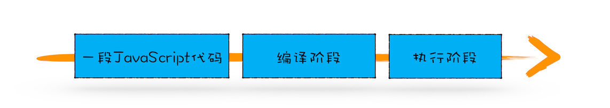
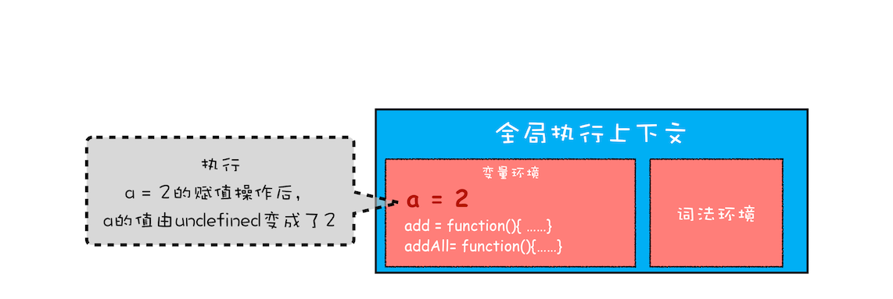

#### 2021.4.19
---
> 变量提升
* 一段 JavaScript 代码在执行之前需要被 JavaScript 引擎编译，编译完成之后，才会进入执行阶段


* 编译阶段: 变量提升 -> 可执行代码

* 执行阶段：JavaScript 引擎开始执行“可执行代码”，按照顺序一行一行地执行.遇到变量在变量环境对象中查找这个变量

> 总结
* JavaScript 代码执行过程中，需要先做变量提升，而之所以需要实现变量提升，是因为 JavaScript 代码在执行之前需要先编译
* 在编译阶段，变量和函数会被存放到变量环境中，变量的默认值会被设置为 undefined；在代码执行阶段，JavaScript 引擎会从变量环境中去查找自定义的变量和函数。
* 如果在编译阶段，存在两个相同的函数，那么最终存放在变量环境中的是最后定义的那个，这是因为后定义的会覆盖掉之前定义的
* js执行机制： 先编译，再执行

---
> 栈溢出
1. 哪些情况下代码才算是“一段”代码，才会在执行之前就进行编译并创建执行上下文
* 当 JavaScript 执行全局代码的时候，会编译全局代码并创建全局执行上下文，而且在整个页面的生存周期内，全局执行上下文只有一份
* 当调用一个函数的时候，函数体内的代码会被编译，并创建函数执行上下文，一般情况下，函数执行结束之后，创建的函数执行上下文会被销毁。
* 当使用 eval 函数的时候，eval 的代码也会被编译，并创建执行上下文
2. 调用栈就是用来管理函数调用关系的一种数据结构
3. 流程
```
    var a = 2
    function add(){
        var b = 10
        return  a+b
    }
    add()
```


* 执行到 add 函数的时候，我们就有了两个执行上下文了——全局执行上下文和 add 函数的执行上下文。
* 多个执行上下文是通过一种叫栈的数据结构来管理的
4. 调用栈流程
```

    var a = 2
    function add(b,c){
        return b+c
    }
    function addAll(b,c){
        var d = 10
        result = add(b,c)
        return  a+result+d
    }
    addAll(3,6)
```
* 创建全局上下文，并将其压入栈底


* js引擎执行全局代码，首先会执行 a=2 的赋值操作，执行该语句会将全局上下文变量环境中 a 的值设置为 2.设置后全局上下文状态如下


* 调用 `addAll` 函数,入栈

addAll 函数的执行上下文创建好之后，便进入了函数代码的执行阶段了，这里先执行的是 d=10 的赋值操作，执行语句会将 addAll 函数执行上下文中的 d 由 undefined 变成了 10。

* 当执行到 add 函数调用语句时，同样会为其创建执行上下文，并将其压入调用栈，如下图所示：

当 add 函数返回时，该函数的执行上下文就会从栈顶弹出，并将 result 的值设置为 add 函数的返回值，也就是 9。如下图所示

紧接着 addAll 执行最后一个相加操作后并返回，addAll 的执行上下文也会从栈顶部弹出，此时调用栈中就只剩下全局上下文了。最终如下图所示：


5. 调用栈是 JavaScript 引擎追踪函数执行的一个机制

6. 调用栈是有大小的，当入栈的执行上下文超过一定数目，JavaScript 引擎就会报错，我们把这种错误叫做栈溢出。
```
    function division(a,b){
        return division(a,b)
    }
    console.log(division(1,2))
```
这个没有任何终止条件的递归会导致栈溢出: 把递归调用的形式改造成其他形式，或者使用加入定时器的方法来把当前任务拆分为其他很多小任务。
*为什么使用定时器可以解决栈移除问题？ function foo() { setTimeout(foo, 0) } foo() 像setTimeout 、setInterval Promise 这样的全局函数不是js 的一部分，而是webapi 部分。 当遇到webApi 时，会将其回调函数(foo)交给web apis 处理，此时 调用栈 中foo 函数执行完毕，出栈，栈为空； 回调函数会被发送到任务队列中，等待event loop 事件循环将其捞出 重新放入到堆栈中*

7. 总结
* 每调用一个函数，JavaScript 引擎会为其创建执行上下文，并把该执行上下文压入调用栈，然后 JavaScript 引擎开始执行函数代码
* 如果在一个函数 A 中调用了另外一个函数 B，那么 JavaScript 引擎会为 B 函数创建执行上下文，并将 B 函数的执行上下文压入栈顶。
* 当前函数执行完毕后，JavaScript 引擎会将该函数的执行上下文弹出栈。
* 当分配的调用栈空间被占满时，会引发“堆栈溢出”问题。

> HTTP报文
1. HTTP 报文结构就像是“大头儿子”，由“起始行 + 头部 + 空行 + 实体”组成，简单地说就是“header+body”；
2. HTTP 报文可以没有 body，但必须要有 header，而且 header 后也必须要有空行，形象地说就是“大头”必须要带着“脖子”；这个空行作用是为了区分header和body
3. 请求头由“请求行 + 头部字段”构成，响应头由“状态行 + 头部字段”构成；
4. 请求行有三部分：请求方法，请求目标和版本号；
5. 状态行也有三部分：版本号，状态码和原因字符串；
6. 头部字段是 key-value 的形式，用“:”分隔，不区分大小写，顺序任意，除了规定的标准头，也可以任意添加自定义字段，实现功能扩展
7. HTTP/1.1 里唯一要求必须提供的头字段是 Host，它必须出现在请求头里，标记虚拟主机名。

> 如何理解请求方法(增post删delete改put查get/head)
1. 请求方法是客户端发出的、要求服务器执行的、对资源的一种操作；
2. 请求方法是对服务器的“指示”，真正应如何处理由服务器来决定；
3. 最常用的请求方法是 GET 和 POST，分别是获取数据和发送数据；
4. HEAD 方法是轻量级的 GET，用来获取资源的元信息；
5. PUT 基本上是 POST 的同义词，多用于更新数据；
6. “安全”(不修改服务器数据，例如get和head)与“幂等”(多次执行相同的操作，结果也都是相同的)是描述请求方法的两个重要属性，具有理论指导意义，可以帮助我们设计系统。

#### 2021.04.20
---
> js执行机制


> http基础篇


#### 2021.04.22
---
> 从输入url到页面显示过程

