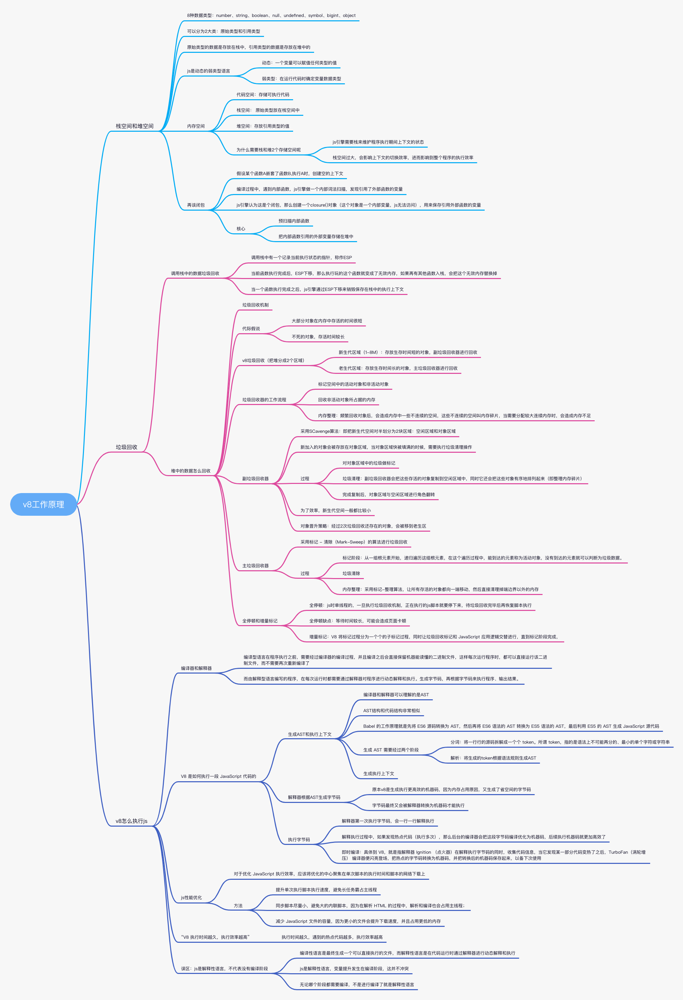

#### 2021.04.25
---
> v8工作原理

> 判断一个链表是不是有环链表

* 思路一： 遍历链表如果1s内还没有找到尾结点为null,就是有环链表
```
    var hasCycle = function(head) {
        let prev = Date.now()
        let result
        while(head) {
            let now = Date.now()
            if (head === null) {
                result = false
                break
            } else {
                head = head.next
            }
            if (now - prev >= 500) {
                result = true
                break
            }
        }
        return result ? true : false
    };
```
* 思路二： 遍历链表，将已遍历的节点存放到数组或者Map或Set结构，如果找到相同的节点，这是有环的
```
    var hasCycle = function(head) {
    let res = new Set()
    while(head) {
        if (res.has(head)) {
            return true
        }
        res.add(head)
        head = head.next
    }
        return false
    };
```
* 思路三： 龟兔赛跑指针，快指针每次加2，慢指针每次加1，如果两指针相遇，则是有环链表
```
    var hasCycle = function(head) {
    let slow = fast = head
        while(slow && fast && fast.next) {
            slow = slow.next
            fast = fast.next.next
            if (slow === fast) return true
        }
        return false
    };
```

#### 2021.04.26
---
> 每日一题
[第 1 题：写 React / Vue 项目时为什么要在列表组件中写 key，其作用是什么？](https://github.com/Advanced-Frontend/Daily-Interview-Question/issues/1)

vue和react都是采用diff算法来对比新旧虚拟节点，从而更新节点。在vue的diff函数中在交叉对比中，当新节点跟旧节点头尾交叉对比没有结果时，会根据新节点的key去对比旧节点数组中的key，从而找到相应旧节点（这里对应的是一个key => index 的map映射）。如果没找到就认为是一个新增节点。而如果没有key，那么就会采用遍历查找的方式去找到对应的旧节点。一种一个map映射，另一种是遍历查找。相比而言。map映射的速度更快。
key最本质的是
>key是给每一个vnode的唯一id,可以依靠key,更准确, 更快的拿到oldVnode中对应的vnode节点。 
1. 更准确 :因为带key就不是就地复用了，在sameNode函数 a.key === b.key对比中可以避免就地复用的情况。所以会更加准确。利用key的唯一性生成map对象来获取对应节点，比遍历方式更快。(这个观点，就是我最初的那个观点。从这个角度看，map会比遍历更快。
2. 当然这也是相对而言不带有key，并且使用简单的模板，基于这个前提下，可以更有效的复用节点，diff速度来看也是不带key更加快速的，因为带key在增删节点上有耗时。这就是vue文档所说的默认模式。但是这个并不是key作用，而是没有key的情况下可以对节点就地复用，提高性能。

[第 2 题：['1', '2', '3'].map(parseInt) what & why ?](https://github.com/Advanced-Frontend/Daily-Interview-Question/issues/4)
第一眼看到这个题目的时候，脑海跳出的答案是 [1, 2, 3]，但是真正的答案是[1, NaN, NaN]。

* 首先让我们回顾一下，map函数的第一个参数callback：
```
    var new_array = arr.map(function callback(currentValue[, index[, array]]) { // Return element for new_array }[, thisArg])
```
这个callback一共可以接收三个参数，其中第一个参数代表当前被处理的元素，而第二个参数代表该元素的索引。
* 而parseInt则是用来解析字符串的，使字符串成为指定基数的十进制整数。
`parseInt(string, radix)`
接收两个参数，第一个表示被处理的值（字符串），第二个表示为解析时的基数。
* 了解这两个函数后，我们可以模拟一下运行情况
1. parseInt('1', 0) //radix为0时，且string参数不以“0x”和“0”开头时，按照10为基数处理。这个时候返回1
2. parseInt('2', 1) //基数为1（1进制）表示的数中，最大值小于2，所以无法解析，返回NaN
3. parseInt('3', 2) //基数为2（2进制）表示的数中，最大值小于3，所以无法解析，返回NaN
map函数返回的是一个数组，所以最后结果为[1, NaN, NaN]

#### 2021.04.28
---
>手写bind函数
```
    Function.prototype.bind1 =function (context) {
        var me = this; // this是foo1
        var args = Array.prototype.slice.call(arguments, 1);
        var bound = function () {
            var innerArgs = Array.prototype.slice.call(arguments);
            var finalArgs = args.concat(innerArgs);
            return me.apply(this instanceof me ? this : context, finalArgs); // 如果是new调用，this指向新对象，新对象的构造函数是bound,
        }
        bound.prototype = this.prototype; // 为什么要修改bound原型呢？因为bound函数中会采用instanceof来判断新对象是不是由me构建出来（instanceof用于测试构造函数的prototype是不是出现在对象原型链的任何位置）
        return bound;
    }
    function foo1 (a) {
        this.a = a
    }

    const obj1 = {}
    var bar = foo1.bind1(obj1)
    bar(2)
    var haha = new bar(3) // 其实是new bound()
```

#### 2021.04.29
---
> 内存泄露查看

chrome中的performance拍下快照，看看js和node去曲线是不是明显升高的，是的话，那么就存在内存泄露
分析： 在memory中查看，看看哪个变量size较大，展开调查，就知道是哪个变量引起的

> webpack
---
1. 配置文件名称: 默认配置文件：webpack.config.js,可通过webpack --config指定配置文件
2. webpack配置组成：entry、output、mode、
```
    module.exports = {
        entry: './src/index.js', ........ 1.打包的入口文件
        output: './dist/main.js', ........ 2.打包的输出
        mode: 'production',........ 3.环境
        module: {
            rules: [{........ 4.loader配置
                test: /\.txt$/,
                use: 'raw-loader'
            }]
        },
        plugins: [........ 5.插件配置
            new HtmlwebpackPlugin({
                template: './src/index.html'
            })
        ]
    }
```
3. 环境搭建:安装 webpack 和 webpack-cli
(1) 创建空 录和 package.json
* mkdir my-project
* cd my-project
* npm init -y
(2) 安装 webpack 和 webpack-cli
* npm install webpack webpack-cli --save-dev
* 检查是否安装成功:./node_modules/.bin/webpack -v
