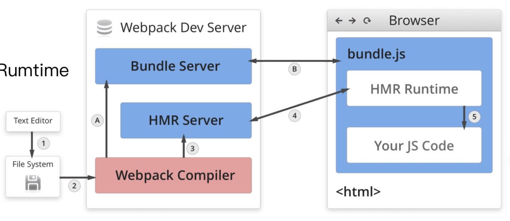

#### 2021.05.17
---
> webpack资源解析:解析css
1. css-loader用于加载.css文件,并且转换成commonjs对象，style-loader将样式通过`<style>`标签插入到html中
安装`npm i style-loader css-loader -D`
```
    'use strict';

    const path = require('path')

    module.exports = {
        entry: {
            index: './src/index.js',
            search: './src/search.js'
        },
        output: {
            path: path.join(__dirname, 'dist'),
            filename: '[name].js'
        },
        mode: 'production',
        module: {
            rules: [{
                test: /.js$/,
                use: 'babel-loader'
            }, {
                test: /.css$/,
                use: [
                    'style-loader',
                    'css-loader'
                ]
            }]
        }
    }
```
2. 解析less
安装`npm i less less-loader -D`
```
    'use strict';

    const path = require('path')

    module.exports = {
        entry: {
            index: './src/index.js',
            search: './src/search.js'
        },
        output: {
            path: path.join(__dirname, 'dist'),
            filename: '[name].js'
        },
        mode: 'production',
        module: {
            rules: [{
                test: /.js$/,
                use: 'babel-loader'
            }, {
                test: /.css$/,
                use: [
                    'style-loader',
                    'css-loader'
                ]
            }, {
                test: /.less$/,
                use: [
                    'style-loader',
                    'css-loader',
                    'less-loader'
                ]
            }]
        }
    }
```
#### 2021.05.19
---
> 解析图片
1. file-loader用于处理文件,如图片和字体
```
'use strict';

    const path = require('path')

    module.exports = {
        entry: {
            index: './src/index.js',
            search: './src/search.js'
        },
        output: {
            path: path.join(__dirname, 'dist'),
            filename: '[name].js'
        },
        mode: 'production',
        module: {
            rules: [{
                test: /.js$/,
                use: 'babel-loader'
            }, {
                test: /.css$/,
                use: [
                    'style-loader',
                    'css-loader'
                ]
            }, {
                test: /.less$/,
                use: [
                    'style-loader',
                    'css-loader',
                    'less-loader'
                ]
            }, {
                test: /.(png|jpg|gif|jpeg)$/,
                use: 'file-loader'
            }, {
                test: /.(woff|woff2|otf|eot|ttf)$/,
                use: 'file-loader'
            }]
        }
    }
```
2. url-loader也可以处理图片和字体,和file-loader差不多，不过url-loader可以设置较小资源自动base64,可以减少请求的链接
```
    'use strict';

    const path = require('path')

    module.exports = {
        entry: {
            index: './src/index.js',
            search: './src/search.js'
        },
        output: {
            path: path.join(__dirname, 'dist'),
            filename: '[name].js'
        },
        mode: 'production',
        module: {
            rules: [{
                test: /.js$/,
                use: 'babel-loader'
            }, {
                test: /.css$/,
                use: [
                    'style-loader',
                    'css-loader'
                ]
            }, {
                test: /.less$/,
                use: [
                    {
                        loader: 'url-loader',
                        options: { // 传入loader的参数
                            limit: 10240
                        }
                    }
                ]
            }, {
                test: /.(png|jpg|gif|jpeg)$/,
                use: 'file-loader'
            }, {
                test: /.(woff|woff2|otf|eot|ttf)$/,
                use: 'file-loader'
            }]
        }
    }
```

> webpack中的文件监听
1. 文件监听是在发现源码发生变化时,自动重新构建出新的输出文件
webpack 开启监听模式，有两种方式
* 启动webpack命令时，带上--watch参数 
```
    // package.json
    scripts: {
        "watch": "webpack --watch"
    }
```
* 在配置webpack.config.js中设置watch: true
* 缺陷: 每次需要手动刷新浏览器

2. 文件监听的原理分析
轮询判断文件的最后编辑时间是否变化
某个文件发生变化，并不会立刻告诉监听者，而是先缓存起来，等 aggregateTimeout
```
    module.export = {
        //默认 false，也就是 开启
        watch: true, //只有开启监听模式时，watchOptions才有意义 
        wathcOptions: {
            //默认为空，不监听的文件或者文件夹，支持正则匹配
            ignored: /node_modules/,
            //监听到变化发生后会等300ms再去执行，默认300ms
            aggregateTimeout: 300, 
            //判断文件是否发生变化是通过不停询问系统指定文件有没有变化实现的，默认每秒问1000次 
            poll: 1000
        } 
    }
```

> webpack热更新 webpack-dev-server
* package.json中新增一个命令： "dev": "webpack serve --open" // open是指打开浏览器
* WDS 不刷新浏览器；WDS不输出文件，而是放在内存中；需要搭配使用webpack的 HotModuleReplacementPlugin插件（开发环境使用）
```
    'use strict';

    const path = require('path')
    const webpack = require('webpack') // 引入webpack,因为HotModuleReplacementPlugin是webpack提供

    module.exports = {
        entry: {
            index: './src/index.js',
            search: './src/search.js'
        },
        output: {
            path: path.join(__dirname, 'dist'),
            filename: '[name].js'
        },
        mode: 'development', // 开发环境下
        module: {
            rules: [{
                test: /.js$/,
                use: 'babel-loader'
            }, {
                test: /.css$/,
                use: [
                    'style-loader',
                    'css-loader'
                ]
            }, {
                test: /.less$/,
                use: [
                    'style-loader',
                    'css-loader',
                    'less-loader'
                ]
            }, {
                test: /.(png|jpg|gif|jpeg)$/,
                use: [{
                    loader: 'url-loader',
                    options: {
                        limit: 10240
                    }
                }]
            }, {
                test: /.(woff|woff2|otf|eot|ttf)$/,
                use: 'file-loader'
            }]
        },
        plugins: [
            new webpack.HotModuleReplacementPlugin() // 与wds搭配使用
        ],
        devServer: {
            contentBase: './dist',  // 服务于这个目录
            hot: true
        }
    }
```
* 热更新原理分析
(1). Webpack Compile: 将 JS 编译成 Bundle
(2). HMR Server: 将热更新的文件输出给HMR Runtime
(3). Bundle Server: 提供文件在浏览器访问
(4). HMR Rumtime: 会被注入到浏览器，更新文件的变化
(5). bundle.js：构建输出的文件


> webpack: 什么是文件指纹？ 
1. 打包后输出的文件名的后缀
2. 文件指纹如何生成: hash、chunkhash、contenthash,只针对生产环境，和热更新不能一起用
3. js文件指纹设置: 设置 output 的 filename，使  [chunkhash]
```
    module.exports = { 
        entry: {
            app: './src/app.js',
            search: './src/search.js'
        },
        output: {
            filename: '[name][chunkhash:8].js',
            path: __dirname + '/dist' 
        }
    };
```
4. css的文件指纹设置: 设置 MiniCssExtractPlugin 的 filename，使用[contenthash]
```
    const MiniCssExtractPlugin = require('mini-css-extract-plugin');
    module.exports = { 
        entry: {
            app: './src/app.js',
            search: './src/search.js'
        },
        output: {
            filename: '[name][chunkhash:8].js',
            path: __dirname + '/dist' 
        },
        module: {
            rules: [{
                    test: /.css$/,
                    use: [
                        MiniCssExtractPlugin.loader,
                        'css-loader'
                    ]
                }, {
                    test: /.less$/,
                    use: [
                        MiniCssExtractPlugin.loader, // style-loader是把css写到header中的style中，MiniCssExtractPlugin和style-loader不兼容
                        'css-loader',
                        'less-loader'
                    ]
                }
            ]
        },
        plugins: [
            new MiniCssExtractPlugin({
                filename: '[name]_[contenthash:8].css'
            })
        ]
    };
```
5. 图片文件的指纹设置： 设置 file-loader 的 name，使用[hash]
```
    'use strict';

    const path = require('path')
    const webpack = require('webpack')
    const MiniCssExtractPlugin = require('mini-css-extract-plugin');

    module.exports = {
        entry: {
            index: './src/index.js',
            search: './src/search.js'
        },
        output: {
            path: path.join(__dirname, 'dist'),
            filename: '[name]_[chunkhash:8].js'
        },
        mode: 'production',
        module: {
            rules: [{
                test: /.js$/,
                use: 'babel-loader'
            }, {
                test: /.css$/,
                use: [
                    MiniCssExtractPlugin.loader,
                    'css-loader'
                ]
            }, {
                test: /.less$/,
                use: [
                    MiniCssExtractPlugin.loader,
                    'css-loader',
                    'less-loader'
                ]
            }, {
                test: /.(png|jpg|gif|jpeg)$/,
                use: [{
                    loader: 'file-loader',
                    options: {
                        name: '[name]_[hash:8].[ext]'
                    }
                }]
            }, {
                test: /.(woff|woff2|otf|eot|ttf)$/,
                use: [{
                    loader: 'file-loader',
                    options: {
                        name: '[name]_[hash:8].[ext]'
                    }
                }]
            }]
        },
        plugins: [
            new MiniCssExtractPlugin({
                filename: '[name]_[contenthash:8].css'
            })
        ]
    }
```

> 代码压缩
1. js文件的压缩：webpack4开始内置了uglifyjs-webpack-plugin,默认打包出来的js是压缩过的
2. css文件的压缩:使用optimize-css-assets-webpack-plugin,同时使用cssnano
3. html文件压缩：html-webpack-plugin,可以设置压缩参数
```
    'use strict';

    const path = require('path')
    const webpack = require('webpack')
    const MiniCssExtractPlugin = require('mini-css-extract-plugin');
    const optimizeCssAssetsWebpackPlugin = require('optimize-css-assets-webpack-plugin')
    const HtmlWebpackPlugin = require('html-webpack-plugin')

    module.exports = {
        entry: {
            index: './src/index.js',
            search: './src/search.js'
        },
        output: {
            path: path.join(__dirname, 'dist'),
            filename: '[name]_[chunkhash:8].js'
        },
        mode: 'production',
        module: {
            rules: [{
                test: /.js$/,
                use: 'babel-loader'
            }, {
                test: /.css$/,
                use: [
                    MiniCssExtractPlugin.loader,
                    'css-loader'
                ]
            }, {
                test: /.less$/,
                use: [
                    MiniCssExtractPlugin.loader,
                    'css-loader',
                    'less-loader'
                ]
            }, {
                test: /.(png|jpg|gif|jpeg)$/,
                use: [{
                    loader: 'file-loader',
                    options: {
                        name: '[name]_[hash:8].[ext]'
                    }
                }]
            }, {
                test: /.(woff|woff2|otf|eot|ttf)$/,
                use: [{
                    loader: 'file-loader',
                    options: {
                        name: '[name]_[hash:8].[ext]'
                    }
                }]
            }]
        },
        plugins: [
            new MiniCssExtractPlugin({
                filename: '[name]_[contenthash:8].css'
            }),
            new optimizeCssAssetsWebpackPlugin({
                // assetNameRegExp: /\.css$/g,
                // cssProcessor: require('cssnano')
                cssProcessorOptions: { // 新写法
                    map: true,
                    preset: ['advanced', {
                        autoprefixer: { add: true },
                    }]
                }
            }),
            new HtmlWebpackPlugin({
                template: path.join(__dirname, 'src/index.html'), // 文件
                filename: 'index.html', // 打包的文件名称
                chunks: ['index'], // 引入的chunk文件（即js文件）
                inject: true,
                minify: {
                    html5: true,
                    collapseWhitespace: true,
                    preserveLineBreaks: false,
                    minifyCSS: true,
                    minifyJS: true,
                    removeComments: false
                }
            }),
            new HtmlWebpackPlugin({
                template: path.join(__dirname, 'src/search.html'),
                filename: 'search.html',
                chunks: ['search'],
                inject: true,
                minify: {
                    html5: true,
                    collapseWhitespace: true,
                    preserveLineBreaks: false,
                    minifyCSS: true,
                    minifyJS: true,
                    removeComments: false
                }
            })
        ]
    }
```

