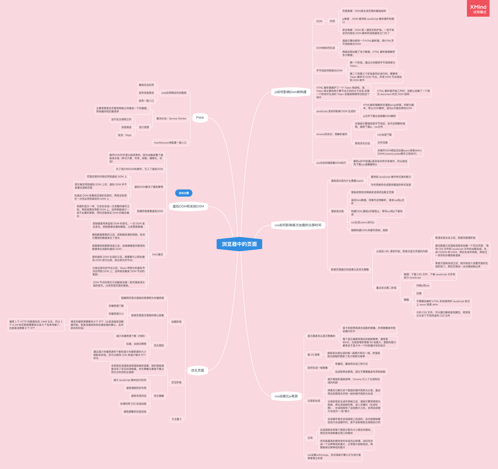
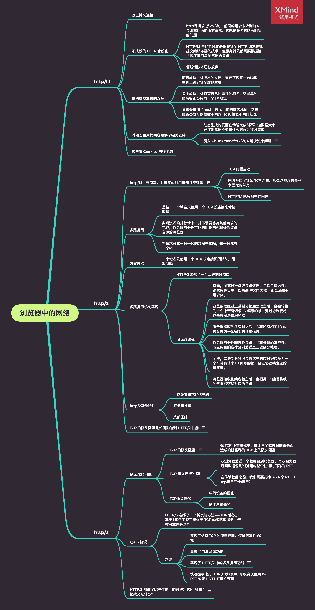

> 2021.05.25
---
# 浏览器中的页面

## js如何影响Dom树构建

### DOM

- 作用

	- 页面角度：DOM是生成页面的基础结构
	- js角度： DOM 提供给 JavaScript 脚本操作的接口
	- 安全角度：DOM 是一道安全防护线，一些不安全的内容在 DOM 解析阶段就被拒之门外了

### DOM树如何生成

- 渲染引擎内部有一个HTML解析器，将HTML字节流转换为DOM
- 网络进程加载了多少数据，HTML 解析器便解析多少数据。

### 字节流如何转换为DOM

- 第一个阶段，通过分词器将字节流转换为 Token。
- 第二个和第三个阶段是同步进行的，需要将 Token 解析为 DOM 节点，并将 DOM 节点添加到 DOM 树中

### HTML 解析器维护了一个 Token 栈结构，该 Token 栈主要用来计算节点之间的父子关系.在第一个阶段中生成的 Token 会被按照顺序压到这个栈中

- HTML 解析器开始工作时，会默认创建了一个根为 document 的空 DOM 结构

### JavaScript 是如何影响 DOM 生成的

- HTML解析器解析时遇到script标签，判断为脚本，停止DOM解析，因为js可能会修改DOM
- js文件下载也会阻塞DOM解析

### chrome的优化：预解析操作

- 当渲染引擎接收到字节流后，会开启预解析线程，提前下载js、css文件
- 其他优化办法

	- cdn加速下载
	- 文件压缩
	- 未操作DOM就延迟加载async或者defer(DOMContentLoaded事件之前执行)

### css也会间接阻塞DOM执行

- 解析js时不知道js是否会对样式有操作，所以就会先下载css,接着解析js

## css如何影响首次加载的白屏时间

### 渲染流水线为什么需要cssom

- 提供给 JavaScript 操作样式表的能力
- 为布局树的合成提供基础的样式信息

### 渲染流水线

- 渲染进程告诉网络发送请求加载主页面
- 返回html数据，同事开启预解析，请求css和js文件
- 构建DOM,遇到js时被阻止，等待css和js下载完成
- css生成cssom,执行js
- 继续构建DOM,构建布局树，绘制

### 影响页面展示的因素以及优化策略

- 从发起 URL 请求开始，到首次显示页面的内容

	- 等请求发出去之后，到提交数据阶段
	- 提交数据之后渲染进程会创建一个空白页面， 等待 CSS 文件和 JavaScript 文件的加载完成，生成 CSSOM 和 DOM，然后合成布局树，再经过一系列的步骤准备渲染
	- 等首次渲染完成之后，就开始进入完整页面的生成阶段了，然后页面会一点点被绘制出来

- 重点关注第二阶段

	- 瓶颈：下载 CSS 文件、下载 JavaScript 文件和执行 JavaScript
	- 策略

		- 内联js和css
		- 压缩
		- 不需要在解析 HTML 阶段使用的 JavaScript 标记上 async 或者 defer
		- 大的 CSS 文件，可以通过媒体查询属性，将其拆分为多个不同用途的 CSS 文件

## css动画比js高效

### 显示器是怎么显示图像的

- 显卡的职责就是合成新的图像，并将图像保存到后缓冲区中
- 每个显示器都有固定的刷新频率，通常是 60HZ，也就是每秒更新 60 张图片，更新的图片都来自于显卡中一个叫前缓冲区的地方

### 帧 VS 帧率

- 渲染流水线生成的每一副图片称为一帧，把渲染流水线每秒更新了多少帧称为帧率

### 如何生成一帧图像

- 有重排、重绘和合成三种方式
- 合成效率会更高，因为不需要触发布局和绘制

### 分层和合成

- 提升每帧的渲染效率，Chrome 引入了分层和合成的机制
- 将素材分解为多个图层的操作就称为分层，最后将这些图层合并到一起的操作就称为合成
- 分层体现在生成布局树之后，渲染引擎将其转为层树，再生成绘制列表，进入光栅化（生成位图），合成线程有了这些图片之后，会将这些图片合成为“一张”图片
- 合成操作是在合成线程上完成的，这也就意味着在执行合成操作时，是不会影响到主线程执行的

### 分块

- 合成线程会将每个图层分割为大小固定的图块，然后优先绘制靠近视口的图块
- 优先级最高的图块有时合成也比较慢，这时先合成一个分辨率低的图片，正常图片绘制完后，再替换掉分辨率低的图片

### css设置willchange，告诉渲染引擎让它为该元素准备独立的层

## 优化页面

### 加载阶段

- 阻塞网页首次渲染的资源称为关键资源
- 影响页面首次渲染的核心因素

	- 关键资源个数
	- 关键资源大小
	- 请求关键资源需要多少个 RTT（从发送端发送数据开始，到发送端收到来自接收端的确认，总共经历的时延）

		- 通常 1 个 HTTP 的数据包在 14KB 左右，所以 1 个 0.1M 的页面就需要拆分成 8 个包来传输了，也就是说需要 8 个 RTT

- 优化原则

	- 减少关键资源个数（内联）
	- 压缩，去掉注释等
	- 通过减少关键资源的个数和减少关键资源的大小搭配来实现。还可以使用 CDN 来减少每次 RTT 时长

### 交互阶段

- 本质是在谈渲染进程渲染帧的速度，帧的渲染速度决定了交互的流畅度，优化策略主要是不要占用太长时间的主线程
- 优化策略

	- 减少 JavaScript 脚本执行时间
	- 避免强制同步布局
	- 避免布局抖动
	- 合理利用 CSS 合成动画
	- 避免频繁的垃圾回收

### 子主题 3

## 虚拟DOM和实际DOM

### 操作DOM代价是比较昂贵的，因为会触发整个渲染流水线（样式计算、布局、绘制，栅格化、合成）

### 为了减少对DOM的操作，引入了虚拟DOM

### 虚拟DOM解决了哪些事情

- 页面改变的内容应用到虚拟 DOM 上
- 变化被应用到虚拟 DOM 上时，虚拟 DOM 并不急着去渲染页面
- 在虚拟 DOM 收集到足够的改变时，再把这些变化一次性应用到真实的 DOM 上

### 双缓存角度看虚拟DOM

- 和图形显示一样，它会在完成一次完整的操作之后，再把结果应用到 DOM 上，这样就能减少一些不必要的更新，同时还能保证 DOM 的稳定输出

### MVC模式

- 控制器是用来监控 DOM 的变化，一旦 DOM 发生变化，控制器便会通知模型，让其更新数据
- 模型数据更新好之后，控制器会通知视图，告诉它模型的数据发生了变化
- 视图接收到更新消息之后，会根据模型所提供的数据来生成新的虚拟 DOM；
- 新的虚拟 DOM 生成好之后，就需要与之前的虚拟 DOM 进行比较，找出变化的节点；
- 比较出变化的节点之后，React 将变化的虚拟节点应用到 DOM 上，这样就会触发 DOM 节点的更新；
- DOM 节点的变化又会触发后续一系列渲染流水线的变化，从而实现页面的更新。

## PWA

### web应用移动化的瓶颈

- 离线无法应用
- 没有消息推送
- 没有一级入口

### 解决办法：Service Worker

- 主要思想是在页面和网络之间增加一个拦截器，用来缓存和拦截请求
- 设计思想

	- 运行在主线程之外
	- 消息推送
	- 安全：https

### manifest.json来配置一级入口

> 浏览器中的网络
---
# 浏览器中的网络

## http/1.1

### 改进持久连接

同一个域名，默认允许同时建立 6 个 TCP 持久连接。在一个 TCP 连接上可以传输多个 HTTP 请求

### 不成熟的 HTTP 管线化

- http是请求-接收机制，前面的请求未收到响应会阻塞后面的所有请求，这就是著名的队头阻塞的问题
- HTTP/1.1 中的管线化是指将多个 HTTP 请求整批提交给服务器的技术，但服务器依然需要根据请求顺序来回复浏览器的请求
- 管线话技术已被放弃

### 提供虚拟主机的支持

- 随着虚拟主机技术的发展，需要实现在一台物理主机上绑定多个虚拟主机
- 每个虚拟主机都有自己的单独的域名，这些单独的域名都公用同一个 IP 地址
- 请求头增加了host，表示当前的域名地址，这样服务器就可以根据不同的 Host 值做不同的处理

### 对动态生成的内容提供了完美支持

- 动态生成的页面在传输完成时不知道数据大小，导致浏览器不知道什么时候会接收完成
- 引入 Chunk transfer 机制来解决这个问题

  服务器会将数据分割成若干个任意大小的数据块，每个数据块发送时会附上上个数据块的长度，最后使用一个零长度的块作为发送数据完成的标志
  
  

### 客户端 Cookie、安全机制

## http/2

### http/1.1主要问题：对带宽的利用率却并不理想

带宽是指每秒最大能发送或者接收的字节数。我们把每秒能发送的最大字节数称为上行带宽，每秒能够接收的最大字节数称为下行带宽。

- TCP 的慢启动

  一旦一个 TCP 连接建立之后，就进入了发送数据状态，刚开始 TCP 协议会采用一个非常慢的速度去发送数据，然后慢慢加快发送数据的速度，直到发送数据的速度达到一个理想状态，我们把这个过程称为慢启动。
  慢启动是 TCP 为了减少网络拥塞的一种策略，我们是没有办法改变的。
  
  拥塞控制的目的是避免过多的数据一下子涌入网络，导致网络超出最大负荷。
  
  tcp拥塞控制
  1. 
  慢启动：发送方向接收方发送 1 个单位的数据，收到对方确认后会发送 2 个单位的数据，然后依次是 4 个、8 个……呈指数级增长，这个过程就是在不断试探网络的拥塞程度，超出阈值则会导致网络拥塞；
  

- 同时开启了多条 TCP 连接，那么这些连接会竞争固定的带宽
- HTTP/1.1 队头阻塞的问题

### 多路复用

- 思路：一个域名只使用一个 TCP 长连接来传输数据

  整个页面资源的下载过程只需要一次慢启动，同时也避免了多个 TCP 连接竞争带宽所带来的问题
  
  

- 实现资源的并行请求，并不需要等待其他请求的完成，然后服务器也可以随时返回处理好的请求资源给浏览器
- 将请求分成一帧一帧的数据去传输，每一帧都有一个id

### 方案总结

- 一个域名只使用一个 TCP 长连接和消除队头阻塞问题

### 多路复用机制实现

- HTTP/2 添加了一个二进制分帧层
- http/2过程

	- 首先，浏览器准备好请求数据，包括了请求行、请求头等信息，如果是 POST 方法，那么还要有请求体。
	- 这些数据经过二进制分帧层处理之后，会被转换为一个个带有请求 ID 编号的帧，通过协议栈将这些帧发送给服务器
	- 服务器接收到所有帧之后，会将所有相同 ID 的帧合并为一条完整的请求信息。
	- 然后服务器处理该条请求，并将处理的响应行、响应头和响应体分别发送至二进制分帧层。
	- 同样，二进制分帧层会将这些响应数据转换为一个个带有请求 ID 编号的帧，经过协议栈发送给浏览器。
	- 浏览器接收到响应帧之后，会根据 ID 编号将帧的数据提交给对应的请求

### http/2其他特性

- 可以设置请求的优先级
- 服务器推送
- 头部压缩

### TCP 的队头阻塞是如何影响到 HTTP/2 性能

TCP传输过程中也是把一份数据分为多个数据包的。当其中一个数据包没有按照顺序返回，接收端会一直保持连接等待数据包返回，这时候就会阻塞后续请求

拥塞控制的目的是避免过多的数据一下子涌入网络，导致网络超出最大负荷
慢启动：发送方向接收方发送 1 个单位的数据，收到对方确认后会发送 2 个单位的数据，然后依次是 4 个、8 个……呈指数级增长，这个过程就是在不断试探网络的拥塞程度，超出阈值则会导致网络拥塞；
拥塞避免：指数增长不可能是无限的，到达某个限制（慢启动阈值）之后，指数增长变为线性增长；
快速重传：发送方每一次发送时都会设置一个超时计时器，超时后即认为丢失，需要重发；
快速恢复：在上面快速重传的基础上，发送方重新发送数据时，也会启动一个超时定时器，如果收到确认消息则进入拥塞避免阶段，如果仍然超时，则回到慢启动阶段

## http/3

### http/2的问题

- TCP 的队头阻塞

  一端发送给另外一端的数据会被拆分为一个个按照顺序排列的数据包，这些数据包通过网络传输到了接收端，接收端再按照顺序将这些数据包组合成原始数据，这样就完成了数据传输
  
  数据传输的过程中，有一个数据因为网络故障或者其他原因而丢包了，那么整个 TCP 的连接就会处于暂停状态，需要等待丢失的数据包被重新传输过来
  
  
  

	- 在 TCP 传输过程中，由于单个数据包的丢失而造成的阻塞称为 TCP 上的队头阻塞

- TCP 建立连接的延时

	- 从浏览器发送一个数据包到服务器，再从服务器返回数据包到浏览器的整个往返时间称为 RTT
	- 在传输数据之前，我们需要花掉 3～4 个 RTT（tcp握手和tls握手）

- TCP协议僵化

	- 中间设备的僵化
	- 操作系统僵化

### QUIC 协议

- HTTP/3 选择了一个折衷的方法——UDP 协议，基于 UDP 实现了类似于 TCP 的多路数据流、传输可靠性等功能
- 功能

	- 实现了类似 TCP 的流量控制、传输可靠性的功能
	- 集成了 TLS 加密功能
	- 实现了 HTTP/2 中的多路复用功能

	  和 TCP 不同，QUIC 实现了在同一物理连接上可以有多个独立的逻辑数据流。实现了数据流的单独传输，就解决了 TCP 中队头阻塞的问题。
	  

	- 快速握手:基于UDP,所以 QUIC 可以实现使用 0-RTT 或者 1-RTT 来建立连接

### HTTP/3 都做了哪些性能上的改进？它所面临的挑战又是什么？

tcp队头阻塞

