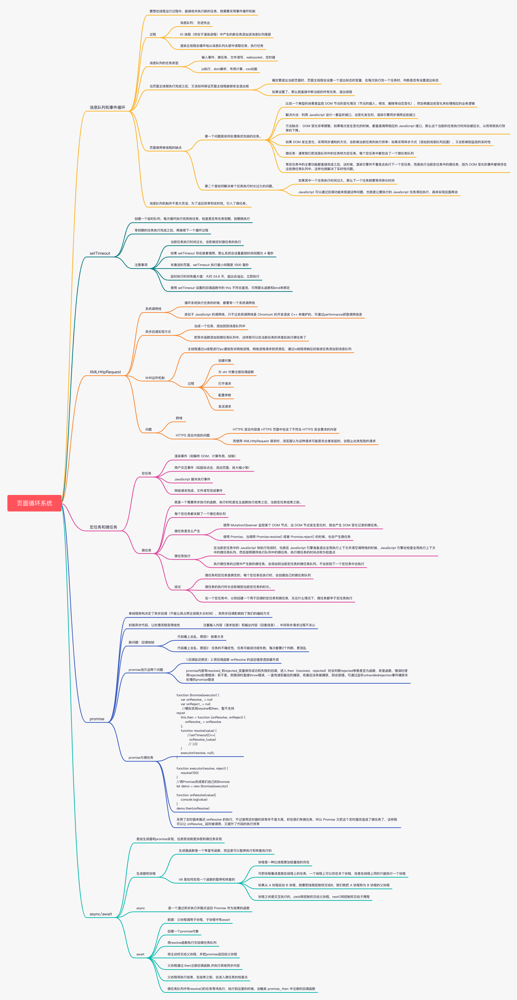

#### 2021.05.08
---
> 页面循环系统


> 反转链表
```
    var reverseList = function(head) {
        let prev = null, cur = head;
        while(cur) {
            let next = cur.next;
            cur.next = prev;
            prev = cur;
            cur = next;
        }
        return prev;
    };
```
> 两两交换链表中的节点
```
    var swapPairs = function (head) {
        let self = new ListNode(0)
        self.next = head
        let prev = self
        while(prev.next && prev.next.next) {
            let [fst, snd] = [prev.next, prev.next.next];
            [prev.next, fst.next, snd.next] = [snd, snd.next, fst];
            prev = prev.next.next;
        }
        return self.next
    }
```
> 链表是否有环
思路一： 判断是否有null,可以设置个时间，如果500ms内还没有碰到null，则说明是无环的
思路二： 遍历链表，把每个节点存放在set结构中，如果有节点和set中的节点相等
思路三： 快慢指针，如果2个指针不相遇，就没有环
```
    // 思路1
    var hasCycle = function(head) {
        let prev = Date.now()
        let result
        while(head) {
            let now = Date.now()
            if (head === null) {
                result = false
                break
            } else {
                head = head.next
            }
            if (now - prev >= 500) {
                result = true
                break
            }
        }
        return result ? true : false
    };
    // 思路2
    var hasCycle = function(head) {
        let res = new Map()
        while(head) {
            if (res.has(head)) {
                return true
            }
            res.set(head)
            head = head.next
        }
        return false
    };
    // 思路3
    var hasCycle = function(head) {
        let slow = fast = head
        while(slow && fast && fast.next) {
            slow = slow.next
            fast = fast.next.next
            if (slow === fast) return true
        }
        return false
    };
```
> 环形链表 II(输出出现环的节点)
```
    var detectCycle = function(head) {
        let res = new Map()
        while(head) {
            if (res.has(head)) {
                return head
            } 
            res.set(head)
            head = head.next
            
        }
        return null
    };
```


> webpack回顾
---
1. 配置文件名称: 默认配置文件：webpack.config.js,可通过webpack --config指定配置文件
2. webpack配置组成：entry、output、mode、
```
    module.exports = {
        entry: './src/index.js', ........ 1.打包的入口文件
        output: './dist/main.js', ........ 2.打包的输出
        mode: 'production',........ 3.环境
        module: {
            rules: [{........ 4.loader配置
                test: /\.txt$/,
                use: 'raw-loader'
            }]
        },
        plugins: [........ 5.插件配置
            new HtmlwebpackPlugin({
                template: './src/index.html'
            })
        ]
    }
```
3. 环境搭建:安装 webpack 和 webpack-cli
(1) 创建空 录和 package.json
* mkdir my-project
* cd my-project
* npm init -y
(2) 安装 webpack 和 webpack-cli
* npm install webpack webpack-cli --save-dev
* 检查是否安装成功:./node_modules/.bin/webpack -v
(3) 打包测试： 创建src目录，创建index.js和helloworld.js，之后用./node_modules/.bin/webpack进行打包，会根据webpack.config.js中的配置生成一个bundle.js文件，再新建一个html文件，引入这个js，就可以在浏览器中打开了
(4) 每次打包这个命令略长，可以在package.json中的scripts里增加一个命令`"build": "webpack"`,接下来就可以使用`npm run build`

> webpack基础用法
1. entry
(1). 用来指定webpack打包的入口,根据入口文件找到相关的依赖
(2). 用法
    a. 单页应用：
    ```
        module.exports = {
            entry: './src/index.js'
        }
    ```
    b. 多入口： entry是一个对象
    ```
        module.exports = {
            entry: {
                app: './src/index.js',
                adminApp: './src/adminApp.js'
            }
        }
    ```
2. output
(1). 用来告诉webpack如何将编译后的文件输出到磁盘
(2). 用法
    a. 单页应用
    ```
        module.exports = {
            entry: './src/index.js',
            output: {
                filename: 'bundle.js',
                path: __dirname + '/dist'
            }
        }
    ```
    b. 多页应用
    ```
        module.exports = {
            entry: './src/index.js',
            output: {
                filename: '[name].js',
                path: __dirname + '/dist'
            }
        }
    ```
3. Loaders
(1). webpack开箱只支持JS和JSON两种文件类型，通过Loaders去支持其他文件类型并把他们转换成有效模块，然后可以添加到依赖图中。本身是一个函数，接受源文件作为参数，返回转换的结果
(2). 常见loader
    |  名称   | 描述 |
    |  ----  | ----  |
    | babel-loader  | 转换ES6、ES7等JS语法 |
    | css-loader  | 支持css文件的加载和解析 |
    | less-loader  | 将less文件转换成css |
    | ts-loader  | 将ts转换成js |
    | file-loader  | 进行图片、字体等的打包 |
    | raw-loader  | 将文件以字符串的形式导入 |
    | thread-loader  | 多进程打包js和css |
(3). 用法: test指定匹配规则，use指定使用loader
```
    const path = require('path')
    module.exports = {
        entry: './src/index.js',
        output: {
            filename: 'bundle.js',
            path: __dirname + '/dist'
        },
        module: {
            rules: [{
                {test: '/\.txt$/', use: 'raw-loader'}
            }]
        }
    }
```
4. plugins
(1). 插件用于bundle文件的优化，资源管理和环境变量注入，作用于整个构建过程。可以简单理解loaders没办法做的事情都可以通过plugins来完成
(2). 常见plugins
    |  名称   | 描述 |
    |  ----  | ----  |
    | commonsChunkPlugin  | 将chunks相同的模块代码提取成公共js |
    | cleanWebpackPlugin  | 清理构建目录 |
    | ExtractTextwebpackPlugin  | 将css从bundle文件里提取成一个单独的css文件 |
    | copyWebpackPlugin  | 将文件或者文件夹拷贝到构建输出的目录 |
    | HtmlWebpackPlugin  | 创建html文件去承载输出的bundle |
    | UglifyjsWebpackPlugin | 压缩js |
    | ZipWebpackPlugin  | 将打包出的资源生成一个zip包 |
(3). 用法: 放到plugins数组
```
    const path = require('path')
    module.exports = {
        entry: './src/index.js',
        output: {
            filename: 'bundle.js',
            path: __dirname + '/dist'
        },
        module: {
            rules: [{
                {test: '/\.txt$/', use: 'raw-loader'}
            }]
        },
        plugins: [
            new HtmlWebpackPlugin({
                tempalte: './src/index.html'
            })
        ]
    }
```
5. mode
(1). 用来指定当前的构建环境： production、 development还是none。设置mode可以使用webpack内置的函数，默认值为production
(2). mode内置函数功能

 |  选项   | 描述 |
 |  ----  | ----  |
 | development  | 设置process.env.NODE_ENV的值为development,开启NamedChunksPlugin和NamedModulesPlugin |
 | production  | 设置process.env.NODE_ENV的值为production,开启很多plugins |
 | none  | 不会设置任何优化选项 |

 6. 资源解析：ES6
 (1). 使用babel-loader，babel的配置文件是.babelrc
 (2). 资源解析： 增加ES6的bebel preset配置
        {
            "preset": [
                "@babel/preset-env" // 增加es6的babel的preset配置
                "@babel/preset-react" // 增加React的babel的preset配置
            ],
            "plugins": [
                "@babel/proposal-class-properties"
            ]
        }
    ```
(3). 安装：`npm i @babel/core @babel/preset-env babel-loader -D`和`npm i react react-dom @babel/preset-react -D`
(4). webpack.config.js中添加`babel-loader`
```
    'use strict';

    const path = require('path')

    module.exports = {
        entry: {
            index: './src/index.js',
            search: './src/search.js'
        },
        output: {
            path: path.join(__dirname, 'dist'),
            filename: '[name].js'
        },
        mode: 'production',
        module: {
            rules: [{
                test: /.js$/,
                use: 'babel-loader'
            }]
        }
    }
```


